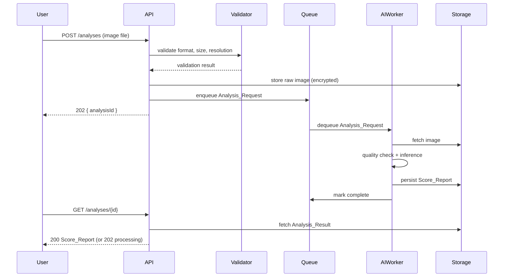
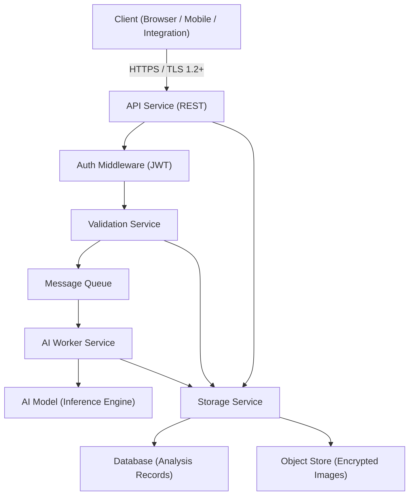

# Design Document: Dental Image Score Analysis

## Overview

This feature provides an AI-powered dental image analysis pipeline. Users upload dental images (JPEG, PNG, DICOM) via a REST API, which validates the image, queues it for AI scoring, and returns a structured Score_Report covering cavity risk, gum health, plaque level, and overall oral health. Results are persisted per user and retrievable with full history pagination.

The system is composed of four primary layers:
- **API Layer**: HTTP endpoints for upload, retrieval, and history
- **Validation Layer**: File format, size, and image quality checks
- **AI Analysis Layer**: Model inference producing scored indicators
- **Storage Layer**: Encrypted persistence of images and results

### System Flow



---

## Architecture



Key design decisions:
- **Async processing**: Upload returns immediately with an `analysisId`; inference runs in a worker. This keeps upload latency under 2 seconds (Req 1.6) while allowing up to 30 seconds for inference (Req 2.6).
- **Separation of validation and inference**: Quality checks run in the validation layer before storage, so low-quality images are never persisted (Req 5.4).
- **Encrypted storage**: Both the object store and database records are encrypted at rest (Req 6.4).

---

## Components and Interfaces

### API Endpoints

```
POST   /analyses                    Upload image, create Analysis_Request
GET    /analyses/{analysisId}       Retrieve Analysis_Result or processing status
GET    /analyses                    List paginated analysis history for authenticated user
```

All endpoints require a valid JWT bearer token (Req 6.1).

### ValidationService

Responsibilities:
- Check MIME type / file extension against allowed set: `image/jpeg`, `image/png`, `application/dicom`
- Check file size ≤ 20 MB
- Decode image header to read pixel dimensions; reject if < 300×300
- Delegate blur/exposure quality check to `ImageQualityChecker`

```
interface ValidationService {
  validateUpload(file: UploadedFile): ValidationResult
}

type ValidationResult =
  | { ok: true }
  | { ok: false; httpStatus: 400 | 415 | 422; message: string }
```

### ImageQualityChecker

Runs lightweight heuristics (Laplacian variance for blur, histogram analysis for exposure) before full inference.

```
interface ImageQualityChecker {
  check(imageBytes: Bytes): QualityCheckResult
}

type QualityCheckResult =
  | { pass: true }
  | { pass: false; reason: "blurry" | "overexposed" | "underexposed"; detail: string }
```

### AnalysisQueue

Decouples HTTP request handling from AI inference.

```
interface AnalysisQueue {
  enqueue(request: AnalysisRequest): void
  dequeue(): AnalysisRequest | null
  markComplete(analysisId: string, result: ScoreReport): void
  markFailed(analysisId: string, error: AnalysisError): void
}
```

### AIWorker

Pulls from the queue, runs quality check, then calls the model.

```
interface AIWorker {
  process(request: AnalysisRequest): Promise<ScoreReport>
}
```

### AIModelClient

Wraps the inference engine (local model or remote ML service).

```
interface AIModelClient {
  infer(imageBytes: Bytes): ModelOutput
}

type ModelOutput = {
  indicators: Array<{
    name: IndicatorName
    score: number        // 0–100
    confidence: number   // 0.0–1.0
  }>
}
```

### StorageService

```
interface StorageService {
  saveImage(userId: string, analysisId: string, imageBytes: Bytes, meta: ImageMeta): void
  getImage(analysisId: string): Bytes
  saveResult(result: AnalysisResult): void
  getResult(analysisId: string): AnalysisResult | null
  listResults(userId: string, cursor: string | null, pageSize: number): Page<AnalysisResult>
}
```

### ScoreReportSerializer

```
interface ScoreReportSerializer {
  serialize(report: ScoreReport): string        // → JSON string
  deserialize(json: string): ScoreReport        // throws ParseError on malformed input
}
```

---

## Data Models

### AnalysisRequest

```typescript
type AnalysisRequest = {
  analysisId: string          // UUID v4
  userId: string
  uploadTimestamp: string     // ISO 8601
  status: "pending" | "processing" | "complete" | "failed"
  imageMeta: ImageMeta
}

type ImageMeta = {
  filename: string
  format: "jpeg" | "png" | "dicom"
  fileSizeBytes: number
  uploadTimestamp: string     // ISO 8601
}
```

### IndicatorScore

```typescript
type IndicatorName = "cavity_risk" | "gum_health" | "plaque_level" | "overall_oral_health"

type IndicatorScore = {
  indicator: IndicatorName
  score: number               // integer 0–100
  confidence: number          // float 0.0–1.0
}
```

### ScoreReport

```typescript
type ScoreReport = {
  analysisId: string
  completedAt: string         // ISO 8601
  indicators: IndicatorScore[]
  imageMeta: ImageMeta
}
```

### AnalysisResult

```typescript
type AnalysisResult = {
  request: AnalysisRequest
  report: ScoreReport | null
  error: AnalysisError | null
}

type AnalysisError = {
  code: "quality_error" | "model_error" | "unknown"
  message: string
}
```

### API Response Shapes

```typescript
// POST /analyses → 202
type UploadResponse = {
  analysisId: string
  status: "pending"
}

// GET /analyses/{id} → 202 while processing
type ProcessingResponse = {
  analysisId: string
  status: "processing"
}

// GET /analyses/{id} → 200 when complete
type ResultResponse = ScoreReport

// GET /analyses → 200
type HistoryResponse = {
  results: AnalysisResult[]
  nextCursor: string | null
}
```

---

## Correctness Properties

*A property is a characteristic or behavior that should hold true across all valid executions of a system — essentially, a formal statement about what the system should do. Properties serve as the bridge between human-readable specifications and machine-verifiable correctness guarantees.*

### Property 1: Format validation accepts supported types and rejects unsupported types

*For any* uploaded file, the API must accept it if and only if its format is one of `jpeg`, `png`, or `dicom`; for any file with an unsupported format the response must be HTTP 415 with a descriptive message.

**Validates: Requirements 1.1, 1.3, 1.5**

---

### Property 2: Size validation rejects oversized files with HTTP 400

*For any* uploaded file whose size exceeds 20 MB, the API must return HTTP 400 with a descriptive error message; for any file at or under 20 MB, size must not be the reason for rejection.

**Validates: Requirements 1.2, 1.4**

---

### Property 3: Upload IDs are unique across all requests

*For any* set of valid image uploads, all returned `analysisId` values must be pairwise distinct.

**Validates: Requirements 1.6**

---

### Property 4: Score_Report structure invariant

*For any* completed Score_Report, it must contain: all four indicators (`cavity_risk`, `gum_health`, `plaque_level`, `overall_oral_health`), a `confidence` value per indicator, a `completedAt` timestamp, and an `imageMeta` object with `filename`, `format`, and `uploadTimestamp`.

**Validates: Requirements 2.2, 2.3, 3.5, 3.6**

---

### Property 5: Indicator score and confidence range invariants

*For any* indicator in any Score_Report, the `score` must be an integer in [0, 100] and the `confidence` must be a float in [0.0, 1.0].

**Validates: Requirements 2.4, 2.5**

---

### Property 6: Quality error includes a descriptive reason

*For any* image that fails quality checks (blurry, overexposed, or insufficient resolution), the error response must include a non-empty string describing the specific quality issue.

**Validates: Requirements 2.7, 5.3**

---

### Property 7: Analysis retrieval round-trip

*For any* successfully completed Analysis_Request, retrieving the result by `analysisId` must return HTTP 200 with a Score_Report equivalent to the one produced by the AI worker.

**Validates: Requirements 3.1, 3.3**

---

### Property 8: In-progress requests return 202

*For any* Analysis_Request that has not yet completed, the GET endpoint must return HTTP 202 with `status: "processing"`.

**Validates: Requirements 3.2**

---

### Property 9: Unknown analysis ID returns 404

*For any* `analysisId` that does not exist in the system, the GET endpoint must return HTTP 404 with a descriptive error message.

**Validates: Requirements 3.4**

---

### Property 10: Completed results are persisted per user

*For any* completed Analysis_Result, querying the Storage_Service for the owning user's history must include that result.

**Validates: Requirements 4.1**

---

### Property 11: History is sorted descending by upload timestamp

*For any* user with multiple completed analyses, the history list must be ordered by `uploadTimestamp` in descending order.

**Validates: Requirements 4.2**

---

### Property 12: Pagination structure invariants

*For any* history response, the result count must be ≤ 20; when more results exist beyond the current page, a non-null `nextCursor` must be present in the response.

**Validates: Requirements 4.3, 4.4**

---

### Property 13: Low-resolution images are rejected and not stored

*For any* image with pixel dimensions below 300×300, the API must return HTTP 422 and the image must not appear in the Storage_Service after the request.

**Validates: Requirements 5.2, 5.4**

---

### Property 14: Unauthenticated requests are rejected

*For any* request to any upload, retrieve, or list endpoint that lacks a valid authentication token, the API must return HTTP 401.

**Validates: Requirements 6.1**

---

### Property 15: Cross-user access is forbidden

*For any* Analysis_Result owned by User A, a request from authenticated User B (where B ≠ A) must receive HTTP 403.

**Validates: Requirements 6.2, 6.3**

---

### Property 16: Score_Report serialization round-trip

*For any* valid Score_Report object, serializing it to JSON and then deserializing the resulting string must produce an object equivalent to the original.

**Validates: Requirements 7.1, 7.2, 7.4, 7.5**

---

### Property 17: Malformed JSON returns HTTP 400

*For any* malformed JSON string submitted as a Score_Report payload, the API must return HTTP 400 with a descriptive parse error message.

**Validates: Requirements 7.3**

---

## Error Handling

| Scenario | HTTP Status | Error Code | Notes |
|---|---|---|---|
| File size > 20 MB | 400 | `FILE_TOO_LARGE` | Include max size in message |
| Unsupported format | 415 | `UNSUPPORTED_FORMAT` | List accepted formats |
| Resolution < 300×300 | 422 | `INSUFFICIENT_RESOLUTION` | Include actual vs required dimensions |
| Blurry / overexposed image | 422 | `IMAGE_QUALITY_ERROR` | Include specific quality issue |
| Malformed JSON body | 400 | `PARSE_ERROR` | Include parse error detail |
| Unknown analysisId | 404 | `NOT_FOUND` | Generic message (no info leak) |
| Cross-user access | 403 | `FORBIDDEN` | No detail about the resource |
| Missing / invalid token | 401 | `UNAUTHORIZED` | |
| AI model inference failure | 500 | `MODEL_ERROR` | Log internally; return generic message |
| Storage failure | 500 | `STORAGE_ERROR` | Log internally; return generic message |

All error responses follow a consistent envelope:

```json
{
  "error": {
    "code": "FILE_TOO_LARGE",
    "message": "File size 25.3 MB exceeds the maximum allowed size of 20 MB."
  }
}
```

### Error Flow: Quality Failure

When a quality error occurs the image must NOT be persisted. The flow is:

1. Validator runs format + size checks → pass
2. Image decoded in memory; resolution check → fail → return 422, stop
3. If resolution passes, `ImageQualityChecker` runs blur/exposure heuristics → fail → return 422, stop
4. Only after all quality checks pass does the image get written to the object store

---

## Testing Strategy

### Dual Testing Approach

Both unit tests and property-based tests are required. They are complementary:
- Unit tests cover specific examples, integration points, and error conditions
- Property tests verify universal invariants across randomly generated inputs

### Property-Based Testing

Use a property-based testing library appropriate for the target language (e.g., `fast-check` for TypeScript/JavaScript, `hypothesis` for Python, `jqwik` for Java).

Each property test must:
- Run a minimum of **100 iterations**
- Include a comment tag referencing the design property in the format:
  `// Feature: dental-image-score-analysis, Property N: <property_text>`
- Be implemented as a **single test per property**

Property tests to implement (one per property above):

| Test | Property | Library Generator Inputs |
|---|---|---|
| Format validation | Property 1 | Random file bytes with random MIME types |
| Size validation | Property 2 | Random file sizes around the 20 MB boundary |
| Upload ID uniqueness | Property 3 | Batches of N valid uploads |
| Score_Report structure | Property 4 | Random ScoreReport instances |
| Score/confidence ranges | Property 5 | Random IndicatorScore instances |
| Quality error description | Property 6 | Random low-quality image descriptors |
| Retrieval round-trip | Property 7 | Random completed AnalysisResult instances |
| In-progress status | Property 8 | Random pending AnalysisRequest instances |
| Unknown ID → 404 | Property 9 | Random UUID strings not in storage |
| Persistence per user | Property 10 | Random users and completed results |
| History sort order | Property 11 | Random lists of AnalysisResult with random timestamps |
| Pagination invariants | Property 12 | Random page sizes and result counts |
| Low-res rejection + no storage | Property 13 | Random images with dimensions < 300×300 |
| Unauthenticated rejection | Property 14 | Random requests without tokens |
| Cross-user 403 | Property 15 | Random pairs of distinct users |
| Serialization round-trip | Property 16 | Random valid ScoreReport objects |
| Malformed JSON → 400 | Property 17 | Random invalid JSON strings |

### Unit Tests

Unit tests should focus on:
- Specific examples for each endpoint (happy path)
- Integration between ValidationService and the API handler
- Integration between AIWorker and StorageService
- Edge cases: exactly 20 MB file, exactly 300×300 image, confidence = 0.0 and 1.0, score = 0 and 100
- Error envelope format consistency

### Test Configuration Example (TypeScript / fast-check)

```typescript
import fc from "fast-check";

// Feature: dental-image-score-analysis, Property 16: Score_Report serialization round-trip
test("ScoreReport serialization round-trip", () => {
  fc.assert(
    fc.property(arbitraryScoreReport(), (report) => {
      const json = serializer.serialize(report);
      const parsed = serializer.deserialize(json);
      expect(parsed).toEqual(report);
    }),
    { numRuns: 100 }
  );
});
```
