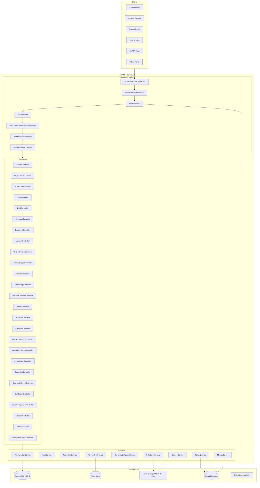
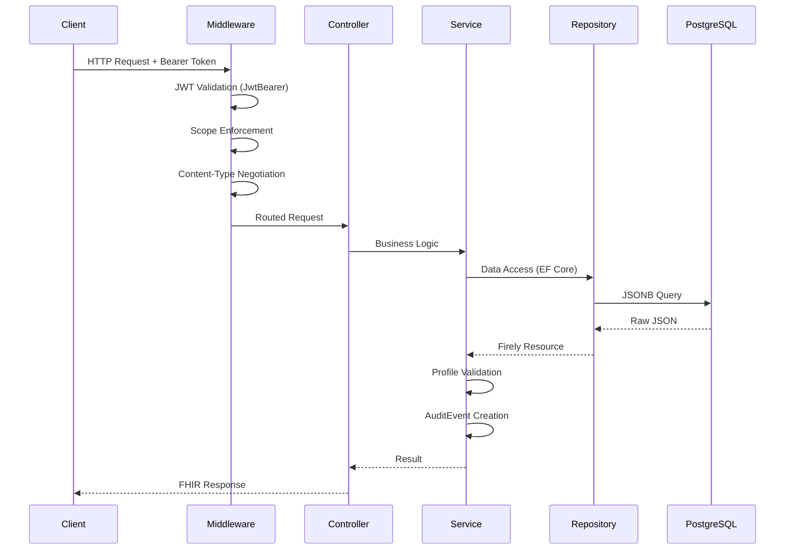
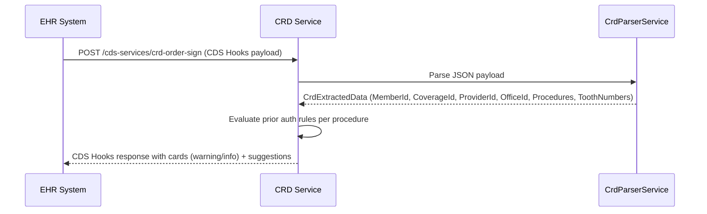

# Design Document: Healthcare FHIR API

## Overview

The Healthcare FHIR API is an HL7 FHIR R4-compliant multi-tenant platform built on ASP.NET Core 8, exposing twenty-one clinical and administrative domains: Patient, Provider (Organization), Practitioner, Claim, Explanation of Benefits (EOB), Coverage, Encounter, Location, RelatedPerson, Payer-to-Payer, Preauthorization, Terminology, Provider Directory, Year-End Reports, Clinical Data (Condition, AllergyIntolerance, MedicationRequest, Immunization, Procedure, DiagnosticReport), Bulk Data Export, SMART App Launch Configuration, Consent Management, Multi-Tenant Architecture, Admin Portal, and CMS Compliance Reporting.

The platform uses the Firely SDK (`Hl7.Fhir.R4`) for FHIR resource modeling and serialization, Entity Framework Core with SQL Server (JSONB-style storage) for persistence, Microsoft.AspNetCore.Authentication.JwtBearer for SMART on FHIR JWT validation, and Redis (StackExchange.Redis) for terminology caching. Testing uses xUnit with FsCheck for property-based tests. The platform supports CMS-9115-F (Patient Access API), CMS-0057-F (Payer-to-Payer with consent), SMART App Launch Framework v2.0, and FHIR Bulk Data Access IG. Each payer tenant receives isolated data storage, tenant-specific configuration, rate limiting, and dedicated compliance reporting.

All endpoints conform to FHIR RESTful semantics (read, search, create, update), return `application/fhir+json` by default, and enforce SMART on FHIR OAuth 2.0 scopes on every request. Multi-tenant isolation is enforced at the middleware and repository layers.

---

## Architecture





---

## Project Structure

```
HealthcareFhirApi.sln
├── src/
│   ├── HealthcareFhirApi.Api/               # ASP.NET Core 8 Web API host
│   │   ├── Controllers/
│   │   │   ├── MetadataController.cs
│   │   │   ├── PatientController.cs
│   │   │   ├── OrganizationController.cs
│   │   │   ├── PractitionerController.cs
│   │   │   ├── ClaimController.cs
│   │   │   ├── ExplanationOfBenefitController.cs
│   │   │   ├── CoverageController.cs
│   │   │   ├── EncounterController.cs
│   │   │   ├── LocationController.cs
│   │   │   ├── RelatedPersonController.cs
│   │   │   ├── PayerToPayerController.cs
│   │   │   ├── PreauthController.cs
│   │   │   ├── TerminologyController.cs
│   │   │   ├── ProviderDirectoryController.cs
│   │   │   ├── ReportController.cs
│   │   │   ├── ConditionController.cs
│   │   │   ├── AllergyIntoleranceController.cs
│   │   │   ├── MedicationRequestController.cs
│   │   │   ├── ImmunizationController.cs
│   │   │   ├── ProcedureController.cs
│   │   │   ├── DiagnosticReportController.cs
│   │   │   ├── BulkExportController.cs
│   │   │   ├── SmartConfigurationController.cs
│   │   │   ├── ConsentController.cs
│   │   │   ├── AdminController.cs
│   │   │   └── ComplianceReportController.cs
│   │   ├── Middleware/
│   │   │   ├── FhirContentNegotiationMiddleware.cs
│   │   │   ├── FhirExceptionMiddleware.cs
│   │   │   ├── AuditLoggingMiddleware.cs
│   │   │   ├── TenantResolutionMiddleware.cs
│   │   │   └── RateLimitingMiddleware.cs
│   │   ├── Filters/
│   │   │   └── ScopeEnforcementFilter.cs
│   │   └── Program.cs
│   ├── HealthcareFhirApi.Core/              # Domain interfaces and models
│   │   ├── Interfaces/
│   │   │   ├── IFhirResourceRepository.cs
│   │   │   ├── IFhirValidationService.cs
│   │   │   ├── IAuditService.cs
│   │   │   ├── IPaginationService.cs
│   │   │   ├── ITerminologyService.cs
│   │   │   ├── ICapabilityStatementBuilder.cs
│   │   │   ├── IBulkExportService.cs
│   │   │   ├── IConsentService.cs
│   │   │   ├── ITenantService.cs
│   │   │   └── IMetricsService.cs
│   │   ├── Models/
│   │   │   ├── SearchParameters.cs
│   │   │   ├── PagedResult.cs
│   │   │   ├── YearEndReportResult.cs
│   │   │   ├── AuditContext.cs
│   │   │   ├── TenantContext.cs
│   │   │   ├── BulkExportJob.cs
│   │   │   ├── ComplianceReportResult.cs
│   │   │   └── SmartConfiguration.cs
│   │   └── Exceptions/
│   │       ├── FhirValidationException.cs
│   │       ├── ResourceNotFoundException.cs
│   │       ├── ScopeViolationException.cs
│   │       ├── UnsupportedMediaTypeException.cs
│   │       ├── TenantResolutionException.cs
│   │       ├── TenantDeactivatedException.cs
│   │       └── RateLimitExceededException.cs
│   ├── HealthcareFhirApi.Infrastructure/    # EF Core, Redis, repositories
│   │   ├── Data/
│   │   │   ├── FhirDbContext.cs
│   │   │   ├── TenantDbContext.cs
│   │   │   └── Migrations/
│   │   ├── Entities/
│   │   │   ├── TenantEntity.cs
│   │   │   ├── ApiKeyEntity.cs
│   │   │   ├── BulkExportJobEntity.cs
│   │   │   └── TenantRateLimitEntity.cs
│   │   ├── Repositories/
│   │   │   └── FhirResourceRepository.cs
│   │   ├── Services/
│   │   │   ├── FhirValidationService.cs
│   │   │   ├── AuditService.cs
│   │   │   ├── PaginationService.cs
│   │   │   ├── TerminologyService.cs
│   │   │   ├── CapabilityStatementBuilder.cs
│   │   │   ├── BulkExportService.cs
│   │   │   ├── ConsentService.cs
│   │   │   ├── TenantService.cs
│   │   │   └── MetricsService.cs
│   │   └── Cache/
│   │       └── RedisTerminologyCache.cs
└── tests/
    ├── HealthcareFhirApi.UnitTests/
    └── HealthcareFhirApi.PropertyTests/
```

---

## Components and Interfaces

### Middleware Pipeline

The ASP.NET Core middleware pipeline processes requests in this order:

1. `TenantResolutionMiddleware` — resolves tenant identity from subdomain, API key header, or JWT `tenant_id` claim; populates `TenantContext`; returns 401 if unresolvable; returns 403 if tenant is deactivated
2. `FhirExceptionMiddleware` — catches all unhandled exceptions, maps to `OperationOutcome` + appropriate HTTP status
3. `UseAuthentication` — validates JWT bearer tokens via `Microsoft.AspNetCore.Authentication.JwtBearer`
4. `UseAuthorization` — enforces SMART on FHIR scope policies
5. `FhirContentNegotiationMiddleware` — validates `Content-Type` / `Accept` headers, sets response format
6. `RateLimitingMiddleware` — enforces tenant-level rate limits; returns 429 when exceeded
7. `AuditLoggingMiddleware` — creates `AuditEvent` records for PHI-touching interactions
8. `UseRouting` / `UseEndpoints` — routes to controllers

```csharp
// Program.cs (abbreviated)
var builder = WebApplication.CreateBuilder(args);

builder.Services.AddAuthentication(JwtBearerDefaults.AuthenticationScheme)
    .AddJwtBearer(options =>
    {
        options.Authority = builder.Configuration["SmartAuth:Authority"];
        options.Audience  = builder.Configuration["SmartAuth:Audience"];
        options.TokenValidationParameters = new TokenValidationParameters
        {
            ValidateIssuerSigningKey = true,
            ValidateLifetime         = true,
            ClockSkew                = TimeSpan.Zero
        };
    });

builder.Services.AddAuthorization(options =>
{
    options.AddPolicy("patient.read",  p => p.RequireClaim("scope", "patient/*.read"));
    options.AddPolicy("system.read",   p => p.RequireClaim("scope", "system/*.read"));
    options.AddPolicy("user.read",     p => p.RequireClaim("scope", "user/*.read"));
    options.AddPolicy("admin",         p => p.RequireRole("admin", "compliance-officer"));
});

// Multi-tenant
builder.Services.AddScoped<TenantContext>();
builder.Services.AddScoped<ITenantService, TenantService>();
builder.Services.AddDbContext<TenantDbContext>(options =>
    options.UseSqlServer(builder.Configuration.GetConnectionString("TenantDb")));

// Bulk export
builder.Services.AddScoped<IBulkExportService, BulkExportService>();

// Consent
builder.Services.AddScoped<IConsentService, ConsentService>();

// Metrics
builder.Services.AddScoped<IMetricsService, MetricsService>();

var app = builder.Build();
app.UseMiddleware<TenantResolutionMiddleware>();
app.UseMiddleware<FhirExceptionMiddleware>();
app.UseAuthentication();
app.UseAuthorization();
app.UseMiddleware<FhirContentNegotiationMiddleware>();
app.UseMiddleware<RateLimitingMiddleware>();
app.UseMiddleware<AuditLoggingMiddleware>();
app.MapControllers();
app.Run();
```

### Core Interfaces

```csharp
// IFhirResourceRepository.cs
public interface IFhirResourceRepository<TResource> where TResource : Resource
{
    Task<TResource?> GetByIdAsync(string id, CancellationToken ct = default);
    Task<PagedResult<TResource>> SearchAsync(SearchParameters parameters, CancellationToken ct = default);
    Task<TResource> CreateAsync(TResource resource, CancellationToken ct = default);
    Task<TResource> UpdateAsync(string id, TResource resource, CancellationToken ct = default);
}

// IFhirValidationService.cs
public interface IFhirValidationService
{
    Task<OperationOutcome> ValidateAsync(Resource resource, string profileUrl, CancellationToken ct = default);
    bool IsValid(OperationOutcome outcome);
}

// IAuditService.cs
public interface IAuditService
{
    Task RecordAsync(AuditContext context, CancellationToken ct = default);
    Task<Bundle> QueryAsync(string clientId, string patientId, CancellationToken ct = default);
}

// IPaginationService.cs
public interface IPaginationService
{
    Bundle BuildSearchBundle(IEnumerable<Resource> resources, SearchParameters parameters, int totalCount, string baseUrl);
    (int skip, int take) ResolvePage(int? count, string? pageToken);
}

// ITerminologyService.cs
public interface ITerminologyService
{
    Task<Parameters> LookupAsync(string system, string code, string? version, CancellationToken ct = default);
    Task<Parameters> ValidateCodeAsync(string url, string system, string code, string? display, CancellationToken ct = default);
    Task<ValueSet> ExpandAsync(string url, string? filter, int? count, CancellationToken ct = default);
    Task<Parameters> TranslateAsync(string url, string system, string code, string targetSystem, CancellationToken ct = default);
}

// ICapabilityStatementBuilder.cs
public interface ICapabilityStatementBuilder
{
    CapabilityStatement Build();
}

// IBulkExportService.cs
public interface IBulkExportService
{
    Task<BulkExportJob> StartExportAsync(
        BulkExportLevel level, string? groupId,
        DateTimeOffset? since, IReadOnlyList<string>? types,
        string outputFormat, CancellationToken ct = default);
    Task<BulkExportJob> GetJobStatusAsync(string jobId, CancellationToken ct = default);
    Task<Stream> DownloadFileAsync(string jobId, string fileName, CancellationToken ct = default);
}

// IConsentService.cs
public interface IConsentService
{
    Task<bool> HasActiveConsentAsync(string patientId, CancellationToken ct = default);
    Task ValidateConsentRequiredFieldsAsync(Consent consent, CancellationToken ct = default);
}

// ITenantService.cs
public interface ITenantService
{
    Task<TenantEntity> GetByIdAsync(string tenantId, CancellationToken ct = default);
    Task<TenantEntity> ProvisionAsync(CreateTenantRequest request, CancellationToken ct = default);
    Task<TenantEntity> UpdateAsync(string tenantId, UpdateTenantRequest request, CancellationToken ct = default);
    Task DeactivateAsync(string tenantId, CancellationToken ct = default);
    Task<TenantEntity?> ResolveFromApiKeyAsync(string apiKey, CancellationToken ct = default);
    Task<TenantEntity?> ResolveFromSubdomainAsync(string subdomain, CancellationToken ct = default);
    Task<ApiKeyEntity> CreateApiKeyAsync(string tenantId, CancellationToken ct = default);
    Task RevokeApiKeyAsync(string tenantId, string keyId, CancellationToken ct = default);
    Task<bool> IsApiKeyValidAsync(string apiKey, CancellationToken ct = default);
    Task SetRateLimitAsync(string tenantId, RateLimitConfig config, CancellationToken ct = default);
}

// IMetricsService.cs
public interface IMetricsService
{
    Task<TenantMetrics> GetMetricsAsync(string tenantId, DateTimeOffset start, DateTimeOffset end, CancellationToken ct = default);
    Task<ComplianceReportResult> GenerateComplianceReportAsync(
        string tenantId, DateTimeOffset start, DateTimeOffset end, CancellationToken ct = default);
    Task RecordRequestAsync(string tenantId, string endpoint, int statusCode, long latencyMs, CancellationToken ct = default);
}
```

### Controller Design

All resource controllers follow the same pattern. They inject the repository, validation service, and audit service. They return `IActionResult` with Firely `Resource` objects serialized by a custom `FhirJsonOutputFormatter`.

```csharp
// PatientController.cs
[ApiController]
[Route("[controller]")]
[Authorize]
public class PatientController : FhirControllerBase
{
    private readonly IFhirResourceRepository<Patient> _repo;
    private readonly IFhirValidationService _validator;
    private readonly IAuditService _audit;
    private readonly IPaginationService _pager;

    public PatientController(
        IFhirResourceRepository<Patient> repo,
        IFhirValidationService validator,
        IAuditService audit,
        IPaginationService pager) { ... }

    [HttpGet("{id}")]
    public async Task<IActionResult> Read(string id, CancellationToken ct);

    [HttpGet]
    public async Task<IActionResult> Search(
        [FromQuery] string? _id,
        [FromQuery] string? identifier,
        [FromQuery] string? name,
        [FromQuery] string? birthdate,
        [FromQuery] string? gender,
        [FromQuery(Name = "address-postalcode")] string? postalCode,
        [FromQuery] int? _count,
        [FromQuery] string? _sort,
        CancellationToken ct);

    [HttpPost]
    public async Task<IActionResult> Create([FromBody] Patient patient, CancellationToken ct);

    [HttpPut("{id}")]
    public async Task<IActionResult> Update(string id, [FromBody] Patient patient, CancellationToken ct);
}

// FhirControllerBase.cs — shared helpers
public abstract class FhirControllerBase : ControllerBase
{
    protected IActionResult FhirNotFound(string resourceType, string id);
    protected IActionResult FhirValidationError(OperationOutcome outcome);
    protected IActionResult FhirCreated(Resource resource, string locationUrl);
    protected IActionResult FhirForbidden(string message);
}
```

The same pattern applies to `OrganizationController`, `PractitionerController`, `ClaimController`, `ExplanationOfBenefitController`, `CoverageController`, `EncounterController`, `LocationController`, `RelatedPersonController`, `ConditionController`, `AllergyIntoleranceController`, `MedicationRequestController`, `ImmunizationController`, `ProcedureController`, and `DiagnosticReportController`.

#### Specialized Controllers

```csharp
// PayerToPayerController.cs
[ApiController]
[Route("Patient")]
[Authorize(Policy = "system.read")]
public class PayerToPayerController : FhirControllerBase
{
    [HttpPost("$member-match")]
    public async Task<IActionResult> MemberMatch([FromBody] Parameters parameters, CancellationToken ct);

    [HttpGet("{id}/$everything")]
    public async Task<IActionResult> Everything(string id, [FromQuery] DateTimeOffset? _since, CancellationToken ct);
}

// PreauthController.cs
[ApiController]
[Route("Claim")]
[Authorize]
public class PreauthController : FhirControllerBase
{
    [HttpPost("$submit")]
    public async Task<IActionResult> Submit([FromBody] Bundle bundle, CancellationToken ct);

    [HttpPost("$inquire")]
    public async Task<IActionResult> Inquire([FromBody] Parameters parameters, CancellationToken ct);
}

// TerminologyController.cs
[ApiController]
[Authorize]
public class TerminologyController : FhirControllerBase
{
    [HttpGet("CodeSystem/$lookup")]
    public async Task<IActionResult> Lookup(
        [FromQuery] string system, [FromQuery] string code, [FromQuery] string? version, CancellationToken ct);

    [HttpGet("ValueSet/$validate-code")]
    public async Task<IActionResult> ValidateCode(
        [FromQuery] string url, [FromQuery] string system, [FromQuery] string code,
        [FromQuery] string? display, CancellationToken ct);

    [HttpGet("ValueSet/$expand")]
    public async Task<IActionResult> Expand(
        [FromQuery] string url, [FromQuery] string? filter, [FromQuery] int? count, CancellationToken ct);

    [HttpGet("ConceptMap/$translate")]
    public async Task<IActionResult> Translate(
        [FromQuery] string url, [FromQuery] string system, [FromQuery] string code,
        [FromQuery] string targetsystem, CancellationToken ct);
}

// ReportController.cs
[ApiController]
[Route("Report")]
[Authorize]
public class ReportController : FhirControllerBase
{
    [HttpGet("year-end")]
    public async Task<IActionResult> YearEnd(
        [FromQuery] string member, [FromQuery] int year,
        [FromQuery] string? format, CancellationToken ct);
}

// MetadataController.cs
[ApiController]
[AllowAnonymous]
public class MetadataController : ControllerBase
{
    [HttpGet("metadata")]
    public IActionResult GetCapabilityStatement();
}
```

#### Clinical Data Controllers (Requirement 20)

Each clinical data controller follows the same CRUD pattern as `PatientController`, with resource-specific search parameters and US Core profile validation.

```csharp
// ConditionController.cs
[ApiController]
[Route("[controller]")]
[Authorize]
public class ConditionController : FhirControllerBase
{
    private const string ProfileUrl = "http://hl7.org/fhir/us/core/StructureDefinition/us-core-condition-problems-health-concerns";

    private readonly IFhirResourceRepository<Condition> _repo;
    private readonly IFhirValidationService _validator;
    private readonly IAuditService _audit;
    private readonly IPaginationService _pager;

    public ConditionController(
        IFhirResourceRepository<Condition> repo,
        IFhirValidationService validator,
        IAuditService audit,
        IPaginationService pager) { ... }

    [HttpGet("{id}")]
    public async Task<IActionResult> Read(string id, CancellationToken ct);

    [HttpGet]
    public async Task<IActionResult> Search(
        [FromQuery] string? patient,
        [FromQuery] string? category,
        [FromQuery(Name = "clinical-status")] string? clinicalStatus,
        [FromQuery(Name = "onset-date")] string? onsetDate,
        [FromQuery] int? _count,
        [FromQuery] string? _sort,
        CancellationToken ct);

    [HttpPost]
    public async Task<IActionResult> Create([FromBody] Condition condition, CancellationToken ct);

    [HttpPut("{id}")]
    public async Task<IActionResult> Update(string id, [FromBody] Condition condition, CancellationToken ct);
}

// AllergyIntoleranceController.cs
[ApiController]
[Route("[controller]")]
[Authorize]
public class AllergyIntoleranceController : FhirControllerBase
{
    private const string ProfileUrl = "http://hl7.org/fhir/us/core/StructureDefinition/us-core-allergyintolerance";

    private readonly IFhirResourceRepository<AllergyIntolerance> _repo;
    private readonly IFhirValidationService _validator;
    private readonly IAuditService _audit;
    private readonly IPaginationService _pager;

    [HttpGet("{id}")]
    public async Task<IActionResult> Read(string id, CancellationToken ct);

    [HttpGet]
    public async Task<IActionResult> Search(
        [FromQuery] string? patient,
        [FromQuery(Name = "clinical-status")] string? clinicalStatus,
        [FromQuery] int? _count,
        [FromQuery] string? _sort,
        CancellationToken ct);

    [HttpPost]
    public async Task<IActionResult> Create([FromBody] AllergyIntolerance resource, CancellationToken ct);

    [HttpPut("{id}")]
    public async Task<IActionResult> Update(string id, [FromBody] AllergyIntolerance resource, CancellationToken ct);
}

// MedicationRequestController.cs
[ApiController]
[Route("[controller]")]
[Authorize]
public class MedicationRequestController : FhirControllerBase
{
    private const string ProfileUrl = "http://hl7.org/fhir/us/core/StructureDefinition/us-core-medicationrequest";

    private readonly IFhirResourceRepository<MedicationRequest> _repo;
    private readonly IFhirValidationService _validator;
    private readonly IAuditService _audit;
    private readonly IPaginationService _pager;

    [HttpGet("{id}")]
    public async Task<IActionResult> Read(string id, CancellationToken ct);

    [HttpGet]
    public async Task<IActionResult> Search(
        [FromQuery] string? patient,
        [FromQuery] string? status,
        [FromQuery] string? intent,
        [FromQuery] int? _count,
        [FromQuery] string? _sort,
        CancellationToken ct);

    [HttpPost]
    public async Task<IActionResult> Create([FromBody] MedicationRequest resource, CancellationToken ct);

    [HttpPut("{id}")]
    public async Task<IActionResult> Update(string id, [FromBody] MedicationRequest resource, CancellationToken ct);
}

// ImmunizationController.cs
[ApiController]
[Route("[controller]")]
[Authorize]
public class ImmunizationController : FhirControllerBase
{
    private const string ProfileUrl = "http://hl7.org/fhir/us/core/StructureDefinition/us-core-immunization";

    private readonly IFhirResourceRepository<Immunization> _repo;
    private readonly IFhirValidationService _validator;
    private readonly IAuditService _audit;
    private readonly IPaginationService _pager;

    [HttpGet("{id}")]
    public async Task<IActionResult> Read(string id, CancellationToken ct);

    [HttpGet]
    public async Task<IActionResult> Search(
        [FromQuery] string? patient,
        [FromQuery] string? date,
        [FromQuery] string? status,
        [FromQuery] int? _count,
        [FromQuery] string? _sort,
        CancellationToken ct);

    [HttpPost]
    public async Task<IActionResult> Create([FromBody] Immunization resource, CancellationToken ct);

    [HttpPut("{id}")]
    public async Task<IActionResult> Update(string id, [FromBody] Immunization resource, CancellationToken ct);
}

// ProcedureController.cs
[ApiController]
[Route("[controller]")]
[Authorize]
public class ProcedureController : FhirControllerBase
{
    private const string ProfileUrl = "http://hl7.org/fhir/us/core/StructureDefinition/us-core-procedure";

    private readonly IFhirResourceRepository<Procedure> _repo;
    private readonly IFhirValidationService _validator;
    private readonly IAuditService _audit;
    private readonly IPaginationService _pager;

    [HttpGet("{id}")]
    public async Task<IActionResult> Read(string id, CancellationToken ct);

    [HttpGet]
    public async Task<IActionResult> Search(
        [FromQuery] string? patient,
        [FromQuery] string? date,
        [FromQuery] string? status,
        [FromQuery] string? code,
        [FromQuery] int? _count,
        [FromQuery] string? _sort,
        CancellationToken ct);

    [HttpPost]
    public async Task<IActionResult> Create([FromBody] Procedure resource, CancellationToken ct);

    [HttpPut("{id}")]
    public async Task<IActionResult> Update(string id, [FromBody] Procedure resource, CancellationToken ct);
}

// DiagnosticReportController.cs
[ApiController]
[Route("[controller]")]
[Authorize]
public class DiagnosticReportController : FhirControllerBase
{
    private const string ProfileUrl = "http://hl7.org/fhir/us/core/StructureDefinition/us-core-diagnosticreport-note";

    private readonly IFhirResourceRepository<DiagnosticReport> _repo;
    private readonly IFhirValidationService _validator;
    private readonly IAuditService _audit;
    private readonly IPaginationService _pager;

    [HttpGet("{id}")]
    public async Task<IActionResult> Read(string id, CancellationToken ct);

    [HttpGet]
    public async Task<IActionResult> Search(
        [FromQuery] string? patient,
        [FromQuery] string? category,
        [FromQuery] string? date,
        [FromQuery] string? code,
        [FromQuery] int? _count,
        [FromQuery] string? _sort,
        CancellationToken ct);

    [HttpPost]
    public async Task<IActionResult> Create([FromBody] DiagnosticReport resource, CancellationToken ct);

    [HttpPut("{id}")]
    public async Task<IActionResult> Update(string id, [FromBody] DiagnosticReport resource, CancellationToken ct);
}
```

#### Bulk Export Controller (Requirement 21)

```csharp
// BulkExportController.cs
[ApiController]
[Authorize(Policy = "system.read")]
public class BulkExportController : FhirControllerBase
{
    private readonly IBulkExportService _exportService;

    public BulkExportController(IBulkExportService exportService) { ... }

    /// <summary>System-level export: POST /$export</summary>
    [HttpPost("/$export")]
    public async Task<IActionResult> SystemExport(
        [FromQuery] DateTimeOffset? _since,
        [FromQuery] string? _type,
        [FromQuery] string? _outputFormat,
        CancellationToken ct);

    /// <summary>Patient-level export: POST /Patient/$export</summary>
    [HttpPost("Patient/$export")]
    public async Task<IActionResult> PatientExport(
        [FromQuery] DateTimeOffset? _since,
        [FromQuery] string? _type,
        [FromQuery] string? _outputFormat,
        CancellationToken ct);

    /// <summary>Group-level export: POST /Group/{id}/$export</summary>
    [HttpPost("Group/{id}/$export")]
    public async Task<IActionResult> GroupExport(
        string id,
        [FromQuery] DateTimeOffset? _since,
        [FromQuery] string? _type,
        [FromQuery] string? _outputFormat,
        CancellationToken ct);

    /// <summary>Poll export job status: GET /$export-poll/{jobId}</summary>
    [HttpGet("/$export-poll/{jobId}")]
    public async Task<IActionResult> PollExportStatus(string jobId, CancellationToken ct);
}
```

#### SMART App Launch Configuration Controller (Requirement 22)

```csharp
// SmartConfigurationController.cs
[ApiController]
[AllowAnonymous]
public class SmartConfigurationController : ControllerBase
{
    private readonly IConfiguration _config;

    public SmartConfigurationController(IConfiguration config) { ... }

    /// <summary>GET /.well-known/smart-configuration</summary>
    [HttpGet("/.well-known/smart-configuration")]
    [Produces("application/json")]
    public IActionResult GetSmartConfiguration()
    {
        var smartConfig = new SmartConfiguration
        {
            AuthorizationEndpoint       = _config["SmartAuth:AuthorizationEndpoint"]!,
            TokenEndpoint               = _config["SmartAuth:TokenEndpoint"]!,
            ScopesSupported             = new[] { "openid", "fhirUser", "launch", "launch/patient",
                                                   "patient/*.read", "user/*.read", "system/*.read",
                                                   "offline_access" },
            CodeChallengeMethodsSupported = new[] { "S256" },
            GrantTypesSupported         = new[] { "authorization_code", "client_credentials" },
            Capabilities                = new[] { "launch-ehr", "launch-standalone", "client-public",
                                                   "client-confidential-symmetric", "sso-openid-connect",
                                                   "permission-v2", "context-ehr-patient" }
        };
        return Ok(smartConfig);
    }
}
```

#### Consent Controller (Requirement 23)

```csharp
// ConsentController.cs
[ApiController]
[Route("[controller]")]
[Authorize]
public class ConsentController : FhirControllerBase
{
    private readonly IFhirResourceRepository<Consent> _repo;
    private readonly IConsentService _consentService;
    private readonly IAuditService _audit;
    private readonly IPaginationService _pager;

    public ConsentController(
        IFhirResourceRepository<Consent> repo,
        IConsentService consentService,
        IAuditService audit,
        IPaginationService pager) { ... }

    [HttpGet("{id}")]
    public async Task<IActionResult> Read(string id, CancellationToken ct);

    [HttpGet]
    public async Task<IActionResult> Search(
        [FromQuery] string? patient,
        [FromQuery] string? status,
        [FromQuery] string? category,
        [FromQuery] string? period,
        [FromQuery] int? _count,
        [FromQuery] string? _sort,
        CancellationToken ct);

    [HttpPost]
    public async Task<IActionResult> Create([FromBody] Consent consent, CancellationToken ct);

    [HttpPut("{id}")]
    public async Task<IActionResult> Update(string id, [FromBody] Consent consent, CancellationToken ct);
}
```

#### Admin Controller (Requirement 25)

```csharp
// AdminController.cs
[ApiController]
[Route("admin")]
[Authorize(Policy = "admin")]
public class AdminController : ControllerBase
{
    private readonly ITenantService _tenantService;
    private readonly IMetricsService _metricsService;

    public AdminController(ITenantService tenantService, IMetricsService metricsService) { ... }

    [HttpPost("tenants")]
    public async Task<IActionResult> CreateTenant([FromBody] CreateTenantRequest request, CancellationToken ct);

    [HttpPut("tenants/{id}")]
    public async Task<IActionResult> UpdateTenant(string id, [FromBody] UpdateTenantRequest request, CancellationToken ct);

    [HttpPatch("tenants/{id}/deactivate")]
    public async Task<IActionResult> DeactivateTenant(string id, CancellationToken ct);

    [HttpGet("tenants/{id}/metrics")]
    public async Task<IActionResult> GetMetrics(
        string id,
        [FromQuery] DateTimeOffset? start,
        [FromQuery] DateTimeOffset? end,
        CancellationToken ct);

    [HttpPut("tenants/{id}/rate-limit")]
    public async Task<IActionResult> ConfigureRateLimit(
        string id, [FromBody] RateLimitConfig config, CancellationToken ct);

    [HttpPost("tenants/{id}/api-keys")]
    public async Task<IActionResult> CreateApiKey(string id, CancellationToken ct);

    [HttpDelete("tenants/{id}/api-keys/{keyId}")]
    public async Task<IActionResult> RevokeApiKey(string id, string keyId, CancellationToken ct);
}
```

#### Compliance Report Controller (Requirement 26)

```csharp
// ComplianceReportController.cs
[ApiController]
[Route("admin/compliance")]
[Authorize(Policy = "admin")]
public class ComplianceReportController : ControllerBase
{
    private readonly IMetricsService _metricsService;
    private readonly ITenantService _tenantService;

    public ComplianceReportController(IMetricsService metricsService, ITenantService tenantService) { ... }

    [HttpGet("report")]
    public async Task<IActionResult> GetComplianceReport(
        [FromQuery] string tenant,
        [FromQuery(Name = "start-date")] DateTimeOffset startDate,
        [FromQuery(Name = "end-date")] DateTimeOffset endDate,
        [FromQuery] string? format,
        CancellationToken ct);
}
```

---

## Data Models

### PostgreSQL Schema (EF Core)

FHIR resources are stored as JSONB in PostgreSQL. EF Core uses the `Npgsql.EntityFrameworkCore.PostgreSQL` provider with JSONB column mapping.

```csharp
// FhirResourceEntity.cs
public class FhirResourceEntity
{
    public string Id           { get; set; } = default!;  // FHIR logical id
    public string ResourceType { get; set; } = default!;  // e.g. "Patient"
    public string Data         { get; set; } = default!;  // JSONB column
    public DateTimeOffset LastUpdated { get; set; }
    public bool IsDeleted      { get; set; }
    public long VersionId      { get; set; }
}

// FhirDbContext.cs
public class FhirDbContext : DbContext
{
    public DbSet<FhirResourceEntity> Resources { get; set; } = default!;

    protected override void OnModelCreating(ModelBuilder modelBuilder)
    {
        modelBuilder.Entity<FhirResourceEntity>(e =>
        {
            e.HasKey(x => new { x.ResourceType, x.Id });
            e.Property(x => x.Data).HasColumnType("jsonb");
            e.HasIndex(x => x.ResourceType);
            e.HasIndex(x => x.LastUpdated);
        });
    }
}
```

### Repository Implementation

```csharp
// FhirResourceRepository.cs
public class FhirResourceRepository<TResource> : IFhirResourceRepository<TResource>
    where TResource : Resource
{
    private readonly FhirDbContext _db;
    private readonly FhirJsonParser _parser;
    private readonly FhirJsonSerializer _serializer;
    private readonly string _resourceType;

    public FhirResourceRepository(FhirDbContext db)
    {
        _db           = db;
        _parser       = new FhirJsonParser();
        _serializer   = new FhirJsonSerializer();
        _resourceType = ModelInfo.GetFhirTypeNameForType(typeof(TResource));
    }

    public async Task<TResource?> GetByIdAsync(string id, CancellationToken ct = default)
    {
        var entity = await _db.Resources
            .Where(r => r.ResourceType == _resourceType && r.Id == id && !r.IsDeleted)
            .FirstOrDefaultAsync(ct);
        return entity is null ? null : _parser.Parse<TResource>(entity.Data);
    }

    public async Task<PagedResult<TResource>> SearchAsync(SearchParameters parameters, CancellationToken ct = default)
    {
        var query = _db.Resources
            .Where(r => r.ResourceType == _resourceType && !r.IsDeleted);

        // Apply JSONB search predicates via EF.Functions.JsonContains or raw SQL
        query = ApplySearchFilters(query, parameters);

        var total = await query.CountAsync(ct);
        var entities = await query
            .OrderBy(r => r.LastUpdated)
            .Skip(parameters.Skip)
            .Take(parameters.Take)
            .ToListAsync(ct);

        var resources = entities.Select(e => _parser.Parse<TResource>(e.Data)).ToList();
        return new PagedResult<TResource>(resources, total, parameters);
    }

    public async Task<TResource> CreateAsync(TResource resource, CancellationToken ct = default)
    {
        resource.Id = Guid.NewGuid().ToString("N");
        resource.Meta = new Meta { LastUpdated = DateTimeOffset.UtcNow, VersionId = "1" };
        var entity = new FhirResourceEntity
        {
            Id           = resource.Id,
            ResourceType = _resourceType,
            Data         = _serializer.SerializeToString(resource),
            LastUpdated  = resource.Meta.LastUpdated!.Value,
            VersionId    = 1
        };
        _db.Resources.Add(entity);
        await _db.SaveChangesAsync(ct);
        return resource;
    }

    public async Task<TResource> UpdateAsync(string id, TResource resource, CancellationToken ct = default)
    {
        var entity = await _db.Resources
            .Where(r => r.ResourceType == _resourceType && r.Id == id)
            .FirstOrDefaultAsync(ct)
            ?? throw new ResourceNotFoundException(_resourceType, id);

        resource.Id = id;
        resource.Meta = new Meta
        {
            LastUpdated = DateTimeOffset.UtcNow,
            VersionId   = (entity.VersionId + 1).ToString()
        };
        entity.Data        = _serializer.SerializeToString(resource);
        entity.LastUpdated = resource.Meta.LastUpdated!.Value;
        entity.VersionId++;
        await _db.SaveChangesAsync(ct);
        return resource;
    }

    private IQueryable<FhirResourceEntity> ApplySearchFilters(
        IQueryable<FhirResourceEntity> query, SearchParameters parameters) { ... }
}
```

### Search and Pagination Models

```csharp
// SearchParameters.cs
public record SearchParameters(
    Dictionary<string, string?> Filters,
    int Skip,
    int Take,
    string? SortField,
    bool SortDescending,
    IReadOnlyList<string> Include,
    IReadOnlyList<string> RevInclude
);

// PagedResult.cs
public record PagedResult<T>(
    IReadOnlyList<T> Items,
    int TotalCount,
    SearchParameters Parameters
);

// AuditContext.cs
public record AuditContext(
    string ClientId,
    string? PatientId,
    string ResourceType,
    string? ResourceId,
    string Action,       // "read" | "search" | "create" | "update"
    DateTimeOffset Timestamp
);

// YearEndReportResult.cs
public record YearEndReportResult(
    string MemberId,
    int Year,
    int TotalClaimsCount,
    decimal TotalPaidAmount,
    decimal TotalPatientResponsibility,
    IReadOnlyList<CoveredServiceSummary> CoveredServices
);

public record CoveredServiceSummary(string ServiceCategory, int ClaimCount, decimal PaidAmount);
```

### Firely SDK Resource Types

The Firely SDK (`Hl7.Fhir.R4`) provides strongly-typed C# classes for all FHIR R4 resources. Key types used:

| FHIR Resource | Firely Type | Domain |
|---|---|---|
| Patient | `Hl7.Fhir.Model.Patient` | Patient API |
| Organization | `Hl7.Fhir.Model.Organization` | Provider API |
| Practitioner | `Hl7.Fhir.Model.Practitioner` | Practitioner API |
| PractitionerRole | `Hl7.Fhir.Model.PractitionerRole` | Practitioner API |
| Claim | `Hl7.Fhir.Model.Claim` | Claim / Preauth API |
| ClaimResponse | `Hl7.Fhir.Model.ClaimResponse` | Claim / Preauth API |
| ExplanationOfBenefit | `Hl7.Fhir.Model.ExplanationOfBenefit` | EOB API |
| Coverage | `Hl7.Fhir.Model.Coverage` | Coverage API |
| Encounter | `Hl7.Fhir.Model.Encounter` | Encounter API |
| Location | `Hl7.Fhir.Model.Location` | Location API |
| RelatedPerson | `Hl7.Fhir.Model.RelatedPerson` | PatientRole API |
| Bundle | `Hl7.Fhir.Model.Bundle` | All search results |
| OperationOutcome | `Hl7.Fhir.Model.OperationOutcome` | All error responses |
| Parameters | `Hl7.Fhir.Model.Parameters` | Terminology / Operations |
| CapabilityStatement | `Hl7.Fhir.Model.CapabilityStatement` | Metadata |
| AuditEvent | `Hl7.Fhir.Model.AuditEvent` | Audit logging |
| ValueSet | `Hl7.Fhir.Model.ValueSet` | Terminology |
| CodeSystem | `Hl7.Fhir.Model.CodeSystem` | Terminology |
| ConceptMap | `Hl7.Fhir.Model.ConceptMap` | Terminology |
| Condition | `Hl7.Fhir.Model.Condition` | Clinical Data API |
| AllergyIntolerance | `Hl7.Fhir.Model.AllergyIntolerance` | Clinical Data API |
| MedicationRequest | `Hl7.Fhir.Model.MedicationRequest` | Clinical Data API |
| Immunization | `Hl7.Fhir.Model.Immunization` | Clinical Data API |
| Procedure | `Hl7.Fhir.Model.Procedure` | Clinical Data API |
| DiagnosticReport | `Hl7.Fhir.Model.DiagnosticReport` | Clinical Data API |
| Consent | `Hl7.Fhir.Model.Consent` | Consent API |
| Group | `Hl7.Fhir.Model.Group` | Bulk Export API |

Serialization uses `FhirJsonSerializer` and `FhirJsonParser` from the Firely SDK, registered as a custom `OutputFormatter` / `InputFormatter` in ASP.NET Core.

```csharp
// FhirJsonInputFormatter.cs
public class FhirJsonInputFormatter : TextInputFormatter
{
    private readonly FhirJsonParser _parser = new();

    public FhirJsonInputFormatter()
    {
        SupportedMediaTypes.Add("application/fhir+json");
        SupportedEncodings.Add(Encoding.UTF8);
    }

    public override async Task<InputFormatterResult> ReadRequestBodyAsync(
        InputFormatterContext context, Encoding encoding)
    {
        using var reader = new StreamReader(context.HttpContext.Request.Body, encoding);
        var body = await reader.ReadToEndAsync();
        var resource = _parser.Parse<Resource>(body);
        return InputFormatterResult.Success(resource);
    }
}

// FhirJsonOutputFormatter.cs
public class FhirJsonOutputFormatter : TextOutputFormatter
{
    private readonly FhirJsonSerializer _serializer = new();

    public FhirJsonOutputFormatter()
    {
        SupportedMediaTypes.Add("application/fhir+json");
        SupportedEncodings.Add(Encoding.UTF8);
    }

    public override async Task WriteResponseBodyAsync(
        OutputFormatterWriteContext context, Encoding selectedEncoding)
    {
        if (context.Object is Resource resource)
        {
            var json = _serializer.SerializeToString(resource);
            await context.HttpContext.Response.WriteAsync(json, selectedEncoding);
        }
    }
}
```

### CapabilityStatement Builder

```csharp
// CapabilityStatementBuilder.cs
public class CapabilityStatementBuilder : ICapabilityStatementBuilder
{
    public CapabilityStatement Build() => new()
    {
        Status      = PublicationStatus.Active,
        Date        = "2024-01-01",
        Kind        = CapabilityStatementKind.Instance,
        FhirVersion = FHIRVersion.N4_0_1,
        Format      = new[] { "application/fhir+json", "application/fhir+xml" },
        Rest        = BuildRestComponents()
    };

    private List<CapabilityStatement.RestComponent> BuildRestComponents() { ... }
}
```

### Pagination Engine

```csharp
// PaginationService.cs
public class PaginationService : IPaginationService
{
    private const int DefaultCount = 20;
    private const int MaxCount     = 100;

    public Bundle BuildSearchBundle(
        IEnumerable<Resource> resources,
        SearchParameters parameters,
        int totalCount,
        string baseUrl)
    {
        var items = resources.ToList();
        var bundle = new Bundle
        {
            Type  = Bundle.BundleType.Searchset,
            Total = totalCount,
            Entry = items.Select(r => new Bundle.EntryComponent { Resource = r }).ToList()
        };

        bundle.Link.Add(new Bundle.LinkComponent { Relation = "self", Url = BuildUrl(baseUrl, parameters) });
        if (parameters.Skip + parameters.Take < totalCount)
            bundle.Link.Add(new Bundle.LinkComponent { Relation = "next", Url = BuildNextUrl(baseUrl, parameters) });
        if (parameters.Skip > 0)
            bundle.Link.Add(new Bundle.LinkComponent { Relation = "previous", Url = BuildPrevUrl(baseUrl, parameters) });

        return bundle;
    }

    public (int skip, int take) ResolvePage(int? count, string? pageToken)
    {
        var take = Math.Min(count ?? DefaultCount, MaxCount);
        var skip = pageToken is not null ? DecodePageToken(pageToken) : 0;
        return (skip, take);
    }

    private string BuildUrl(string baseUrl, SearchParameters p) { ... }
    private string BuildNextUrl(string baseUrl, SearchParameters p) { ... }
    private string BuildPrevUrl(string baseUrl, SearchParameters p) { ... }
    private int DecodePageToken(string token) { ... }
}
```

### Terminology Service with Redis Cache

```csharp
// TerminologyService.cs
public class TerminologyService : ITerminologyService
{
    private static readonly HashSet<string> SupportedSystems = new()
    {
        "http://snomed.info/sct",
        "http://loinc.org",
        "http://hl7.org/fhir/sid/icd-10",
        "http://www.ama-assn.org/go/cpt",
        "http://www.nlm.nih.gov/research/umls/rxnorm"
    };

    private readonly IDatabase _redis;
    private readonly FhirDbContext _db;

    public async Task<Parameters> LookupAsync(string system, string code, string? version, CancellationToken ct)
    {
        if (!SupportedSystems.Contains(system))
            throw new UnsupportedCodeSystemException(system);

        var cacheKey = $"lookup:{system}:{code}:{version}";
        var cached   = await _redis.StringGetAsync(cacheKey);
        if (cached.HasValue)
            return new FhirJsonParser().Parse<Parameters>(cached!);

        var result = await PerformLookupAsync(system, code, version, ct);
        await _redis.StringSetAsync(cacheKey, new FhirJsonSerializer().SerializeToString(result),
            TimeSpan.FromHours(24));
        return result;
    }

    public async Task<Parameters> ValidateCodeAsync(
        string url, string system, string code, string? display, CancellationToken ct) { ... }

    public async Task<ValueSet> ExpandAsync(
        string url, string? filter, int? count, CancellationToken ct) { ... }

    public async Task<Parameters> TranslateAsync(
        string url, string system, string code, string targetSystem, CancellationToken ct) { ... }

    private async Task<Parameters> PerformLookupAsync(
        string system, string code, string? version, CancellationToken ct) { ... }
}
```

### Audit Service

```csharp
// AuditService.cs
public class AuditService : IAuditService
{
    private readonly IFhirResourceRepository<AuditEvent> _repo;

    public async Task RecordAsync(AuditContext context, CancellationToken ct)
    {
        var auditEvent = new AuditEvent
        {
            Type    = new Coding("http://terminology.hl7.org/CodeSystem/audit-event-type", "rest"),
            Action  = MapAction(context.Action),
            Recorded = context.Timestamp,
            Agent   = new List<AuditEvent.AgentComponent>
            {
                new() { Who = new ResourceReference($"Client/{context.ClientId}"), Requestor = true }
            },
            Entity  = new List<AuditEvent.EntityComponent>
            {
                new()
                {
                    What = new ResourceReference($"{context.ResourceType}/{context.ResourceId}"),
                    Type = new Coding("http://terminology.hl7.org/CodeSystem/audit-entity-type", "2")
                }
            }
        };
        await _repo.CreateAsync(auditEvent, ct);
    }

    public async Task<Bundle> QueryAsync(string clientId, string patientId, CancellationToken ct)
    {
        // Returns only AuditEvents scoped to the client's authorized patient population
        var parameters = new SearchParameters(
            Filters: new Dictionary<string, string?> { ["patient"] = patientId, ["agent"] = clientId },
            Skip: 0, Take: 100, SortField: "date", SortDescending: true,
            Include: Array.Empty<string>(), RevInclude: Array.Empty<string>());
        var result = await _repo.SearchAsync(parameters, ct);
        return BuildBundle(result.Items);
    }

    private AuditEvent.AuditEventAction MapAction(string action) => action switch
    {
        "read"   => AuditEvent.AuditEventAction.R,
        "search" => AuditEvent.AuditEventAction.E,
        "create" => AuditEvent.AuditEventAction.C,
        "update" => AuditEvent.AuditEventAction.U,
        _        => AuditEvent.AuditEventAction.E
    };
}
```

### Multi-Tenant Infrastructure (Requirement 24)

#### TenantContext

```csharp
// TenantContext.cs — scoped per-request, populated by TenantResolutionMiddleware
public class TenantContext
{
    public string TenantId { get; set; } = default!;
    public string OrganizationName { get; set; } = default!;
    public bool IsActive { get; set; }
    public string? SmartAuthority { get; set; }
    public string? DatabaseConnectionString { get; set; }
}
```

#### TenantResolutionMiddleware

```csharp
// TenantResolutionMiddleware.cs
public class TenantResolutionMiddleware(RequestDelegate next)
{
    public async Task InvokeAsync(HttpContext context, ITenantService tenantService, TenantContext tenantContext)
    {
        // Skip tenant resolution for unauthenticated endpoints
        var endpoint = context.GetEndpoint();
        if (endpoint?.Metadata.GetMetadata<AllowAnonymousAttribute>() is not null)
        {
            await next(context);
            return;
        }

        var tenant = await ResolveTenantAsync(context, tenantService);
        if (tenant is null)
        {
            throw new TenantResolutionException("Unable to resolve tenant from request");
        }

        if (!tenant.IsActive)
        {
            throw new TenantDeactivatedException(tenant.Id);
        }

        tenantContext.TenantId                 = tenant.Id;
        tenantContext.OrganizationName          = tenant.OrganizationName;
        tenantContext.IsActive                  = tenant.IsActive;
        tenantContext.SmartAuthority            = tenant.SmartAuthority;
        tenantContext.DatabaseConnectionString  = tenant.DatabaseConnectionString;

        await next(context);
    }

    private static async Task<TenantEntity?> ResolveTenantAsync(
        HttpContext context, ITenantService tenantService)
    {
        // Strategy 1: X-Tenant-Id header / API key
        if (context.Request.Headers.TryGetValue("X-Api-Key", out var apiKey))
            return await tenantService.ResolveFromApiKeyAsync(apiKey!);

        // Strategy 2: JWT tenant_id claim
        var tenantClaim = context.User.FindFirst("tenant_id")?.Value;
        if (tenantClaim is not null)
            return await tenantService.GetByIdAsync(tenantClaim);

        // Strategy 3: Subdomain
        var host = context.Request.Host.Host;
        var subdomain = host.Split('.').FirstOrDefault();
        if (subdomain is not null)
            return await tenantService.ResolveFromSubdomainAsync(subdomain);

        return null;
    }
}
```

#### RateLimitingMiddleware

```csharp
// RateLimitingMiddleware.cs
public class RateLimitingMiddleware(RequestDelegate next)
{
    public async Task InvokeAsync(HttpContext context, TenantContext tenantContext, ITenantService tenantService)
    {
        // Rate limiting is enforced per-tenant using a sliding window counter in Redis
        var isWithinLimit = await tenantService.CheckRateLimitAsync(tenantContext.TenantId);
        if (!isWithinLimit)
        {
            throw new RateLimitExceededException(tenantContext.TenantId);
        }

        await next(context);
    }
}
```

#### Tenant Entity and TenantDbContext

```csharp
// TenantEntity.cs
public class TenantEntity
{
    public string Id                     { get; set; } = default!;
    public string OrganizationName       { get; set; } = default!;
    public string ContactEmail           { get; set; } = default!;
    public string PlanTier               { get; set; } = default!;  // "basic", "standard", "enterprise"
    public bool IsActive                 { get; set; } = true;
    public string? SmartAuthority        { get; set; }
    public string? DatabaseConnectionString { get; set; }
    public DateTimeOffset CreatedAt      { get; set; }
    public DateTimeOffset UpdatedAt      { get; set; }
    public int RateLimitRequestsPerSecond { get; set; } = 100;
    public int RateLimitBurstSize        { get; set; } = 200;
}

// ApiKeyEntity.cs
public class ApiKeyEntity
{
    public string Id        { get; set; } = default!;
    public string TenantId  { get; set; } = default!;
    public string KeyHash   { get; set; } = default!;  // SHA-256 hash of the API key
    public string KeyPrefix { get; set; } = default!;  // First 8 chars for identification
    public bool IsRevoked   { get; set; }
    public DateTimeOffset CreatedAt { get; set; }
    public DateTimeOffset? RevokedAt { get; set; }
}

// TenantDbContext.cs
public class TenantDbContext : DbContext
{
    public TenantDbContext(DbContextOptions<TenantDbContext> options) : base(options) { }

    public DbSet<TenantEntity> Tenants { get; set; } = default!;
    public DbSet<ApiKeyEntity> ApiKeys { get; set; } = default!;
    public DbSet<BulkExportJobEntity> BulkExportJobs { get; set; } = default!;

    protected override void OnModelCreating(ModelBuilder modelBuilder)
    {
        modelBuilder.Entity<TenantEntity>(e =>
        {
            e.HasKey(x => x.Id);
            e.HasIndex(x => x.OrganizationName).IsUnique();
        });

        modelBuilder.Entity<ApiKeyEntity>(e =>
        {
            e.HasKey(x => x.Id);
            e.HasIndex(x => x.KeyHash).IsUnique();
            e.HasIndex(x => x.TenantId);
        });

        modelBuilder.Entity<BulkExportJobEntity>(e =>
        {
            e.HasKey(x => x.Id);
            e.HasIndex(x => x.TenantId);
            e.HasIndex(x => x.Status);
        });
    }
}
```

#### Tenant-Scoped FhirResourceRepository

The existing `FhirResourceRepository<TResource>` is extended to scope all queries by `TenantId`. The `FhirResourceEntity` gains a `TenantId` column:

```csharp
// FhirResourceEntity.cs (updated)
public class FhirResourceEntity
{
    public string Id           { get; set; } = default!;
    public string ResourceType { get; set; } = default!;
    public string TenantId     { get; set; } = default!;  // NEW: tenant isolation
    public string Data         { get; set; } = default!;
    public DateTimeOffset LastUpdated { get; set; }
    public bool IsDeleted      { get; set; }
    public long VersionId      { get; set; }
}

// FhirResourceRepository.cs (updated — all queries scoped by TenantContext.TenantId)
public class FhirResourceRepository<TResource> : IFhirResourceRepository<TResource>
    where TResource : Resource
{
    private readonly FhirDbContext _db;
    private readonly TenantContext _tenantContext;

    public async Task<TResource?> GetByIdAsync(string id, CancellationToken ct = default)
    {
        var entity = await _db.Resources
            .Where(r => r.TenantId == _tenantContext.TenantId
                     && r.ResourceType == _resourceType
                     && r.Id == id && !r.IsDeleted)
            .FirstOrDefaultAsync(ct);
        return entity is null ? null : _parser.Parse<TResource>(entity.Data);
    }

    // All other methods similarly filter by _tenantContext.TenantId
}
```

### Bulk Export Infrastructure (Requirement 21)

```csharp
// BulkExportJob.cs
public record BulkExportJob(
    string JobId,
    BulkExportStatus Status,
    BulkExportLevel Level,
    string? GroupId,
    DateTimeOffset? Since,
    IReadOnlyList<string>? Types,
    string OutputFormat,
    DateTimeOffset RequestedAt,
    DateTimeOffset? CompletedAt,
    int? ProgressPercent,
    IReadOnlyList<BulkExportOutputFile>? OutputFiles
);

public record BulkExportOutputFile(string Type, string Url);

public enum BulkExportStatus { Accepted, InProgress, Complete, Error }
public enum BulkExportLevel { System, Patient, Group }

// BulkExportJobEntity.cs
public class BulkExportJobEntity
{
    public string Id          { get; set; } = default!;
    public string TenantId    { get; set; } = default!;
    public string Status      { get; set; } = default!;
    public string Level       { get; set; } = default!;
    public string? GroupId    { get; set; }
    public DateTimeOffset? Since { get; set; }
    public string? Types      { get; set; }  // comma-separated
    public string OutputFormat { get; set; } = "application/fhir+ndjson";
    public DateTimeOffset RequestedAt { get; set; }
    public DateTimeOffset? CompletedAt { get; set; }
    public int? ProgressPercent { get; set; }
    public string? OutputFilesJson { get; set; }  // JSON array of {type, url}
}

// BulkExportService.cs
public class BulkExportService : IBulkExportService
{
    private static readonly HashSet<string> SupportedTypes = new()
    {
        "Patient", "Condition", "AllergyIntolerance", "MedicationRequest",
        "Immunization", "Procedure", "DiagnosticReport", "Coverage",
        "ExplanationOfBenefit", "Claim", "Encounter", "Organization",
        "Practitioner", "Location"
    };

    private readonly TenantDbContext _tenantDb;
    private readonly FhirDbContext _fhirDb;
    private readonly TenantContext _tenantContext;

    public async Task<BulkExportJob> StartExportAsync(
        BulkExportLevel level, string? groupId,
        DateTimeOffset? since, IReadOnlyList<string>? types,
        string outputFormat, CancellationToken ct = default)
    {
        // Validate _type parameter
        if (types is not null)
        {
            var unsupported = types.Except(SupportedTypes).ToList();
            if (unsupported.Any())
                throw new UnsupportedResourceTypeException(unsupported.First());
        }

        var job = new BulkExportJobEntity
        {
            Id            = Guid.NewGuid().ToString("N"),
            TenantId      = _tenantContext.TenantId,
            Status        = "Accepted",
            Level         = level.ToString(),
            GroupId       = groupId,
            Since         = since,
            Types         = types is not null ? string.Join(",", types) : null,
            OutputFormat  = outputFormat,
            RequestedAt   = DateTimeOffset.UtcNow
        };

        _tenantDb.BulkExportJobs.Add(job);
        await _tenantDb.SaveChangesAsync(ct);

        // Queue background processing (via IHostedService or message queue)
        return MapToJob(job);
    }

    public async Task<BulkExportJob> GetJobStatusAsync(string jobId, CancellationToken ct = default)
    {
        var entity = await _tenantDb.BulkExportJobs
            .Where(j => j.Id == jobId && j.TenantId == _tenantContext.TenantId)
            .FirstOrDefaultAsync(ct)
            ?? throw new ResourceNotFoundException("BulkExportJob", jobId);
        return MapToJob(entity);
    }

    private static BulkExportJob MapToJob(BulkExportJobEntity e) { ... }
}
```

### SMART Configuration Model (Requirement 22)

```csharp
// SmartConfiguration.cs
public class SmartConfiguration
{
    [JsonPropertyName("authorization_endpoint")]
    public string AuthorizationEndpoint { get; set; } = default!;

    [JsonPropertyName("token_endpoint")]
    public string TokenEndpoint { get; set; } = default!;

    [JsonPropertyName("scopes_supported")]
    public string[] ScopesSupported { get; set; } = Array.Empty<string>();

    [JsonPropertyName("code_challenge_methods_supported")]
    public string[] CodeChallengeMethodsSupported { get; set; } = Array.Empty<string>();

    [JsonPropertyName("grant_types_supported")]
    public string[] GrantTypesSupported { get; set; } = Array.Empty<string>();

    [JsonPropertyName("capabilities")]
    public string[] Capabilities { get; set; } = Array.Empty<string>();
}
```

### Consent Service (Requirement 23)

```csharp
// ConsentService.cs
public class ConsentService : IConsentService
{
    private readonly IFhirResourceRepository<Consent> _repo;

    public async Task<bool> HasActiveConsentAsync(string patientId, CancellationToken ct = default)
    {
        var result = await _repo.SearchAsync(new SearchParameters(
            Filters: new Dictionary<string, string?> { ["patient"] = patientId, ["status"] = "active" },
            Skip: 0, Take: 1, SortField: null, SortDescending: false,
            Include: Array.Empty<string>(), RevInclude: Array.Empty<string>()), ct);
        return result.TotalCount > 0;
    }

    public Task ValidateConsentRequiredFieldsAsync(Consent consent, CancellationToken ct = default)
    {
        var missing = new List<string>();
        if (consent.Scope is null) missing.Add("scope");
        if (consent.Patient is null) missing.Add("patient");
        if (consent.Period is null) missing.Add("period");

        if (missing.Any())
        {
            var outcome = new OperationOutcome
            {
                Issue = missing.Select(f => new OperationOutcome.IssueComponent
                {
                    Severity    = OperationOutcome.IssueSeverity.Error,
                    Code        = OperationOutcome.IssueType.Required,
                    Diagnostics = $"Required element '{f}' is missing"
                }).ToList()
            };
            throw new FhirValidationException(outcome);
        }

        return Task.CompletedTask;
    }
}
```

### Compliance Report Model (Requirement 26)

```csharp
// ComplianceReportResult.cs
public record ComplianceReportResult(
    string TenantId,
    DateTimeOffset StartDate,
    DateTimeOffset EndDate,
    decimal UptimePercentage,
    IReadOnlyList<EndpointMetric> EndpointMetrics,
    long TotalRequests,
    decimal OverallErrorRate
);

public record EndpointMetric(
    string Endpoint,
    long RequestCount,
    decimal AverageLatencyMs,
    decimal ErrorRatePercent
);

// TenantMetrics.cs
public record TenantMetrics(
    string TenantId,
    long TotalRequests,
    long TotalErrors,
    decimal AverageLatencyMs,
    IReadOnlyList<EndpointMetric> EndpointBreakdown
);

// Request/Response models for Admin API
public record CreateTenantRequest(string OrganizationName, string ContactEmail, string PlanTier);
public record UpdateTenantRequest(string? OrganizationName, string? ContactEmail, string? PlanTier);
public record RateLimitConfig(int RequestsPerSecond, int BurstSize);
```

### New Exception Types

```csharp
// TenantResolutionException.cs
public class TenantResolutionException(string message)
    : Exception(message);

// TenantDeactivatedException.cs
public class TenantDeactivatedException(string tenantId)
    : Exception($"Tenant '{tenantId}' is deactivated");

// RateLimitExceededException.cs
public class RateLimitExceededException(string tenantId)
    : Exception($"Rate limit exceeded for tenant '{tenantId}'");

// UnsupportedResourceTypeException.cs
public class UnsupportedResourceTypeException(string resourceType)
    : Exception($"Unsupported resource type for bulk export: {resourceType}");

// ConsentRequiredException.cs
public class ConsentRequiredException(string patientId)
    : Exception($"No active consent found for patient '{patientId}'");
```

---

## Error Handling

### Custom Exception Types

```csharp
// ResourceNotFoundException.cs
public class ResourceNotFoundException(string resourceType, string id)
    : Exception($"{resourceType}/{id} not found");

// FhirValidationException.cs
public class FhirValidationException(OperationOutcome outcome)
    : Exception("FHIR profile validation failed")
{
    public OperationOutcome Outcome { get; } = outcome;
}

// ScopeViolationException.cs
public class ScopeViolationException(string requiredScope)
    : Exception($"Required scope '{requiredScope}' not granted");

// UnsupportedMediaTypeException.cs
public class UnsupportedMediaTypeException(string contentType)
    : Exception($"Unsupported media type: {contentType}");

// UnsupportedCodeSystemException.cs
public class UnsupportedCodeSystemException(string system)
    : Exception($"Unsupported code system: {system}");

// ResourceTypeMismatchException.cs
public class ResourceTypeMismatchException(string expected, string actual)
    : Exception($"Expected resourceType '{expected}', got '{actual}'");
```

### Exception Middleware

```csharp
// FhirExceptionMiddleware.cs
public class FhirExceptionMiddleware(RequestDelegate next)
{
    public async Task InvokeAsync(HttpContext context)
    {
        try
        {
            await next(context);
        }
        catch (ResourceNotFoundException ex)
        {
            await WriteOperationOutcome(context, 404, "not-found", ex.Message);
        }
        catch (FhirValidationException ex)
        {
            context.Response.StatusCode = 422;
            context.Response.ContentType = "application/fhir+json";
            await context.Response.WriteAsync(new FhirJsonSerializer().SerializeToString(ex.Outcome));
        }
        catch (ScopeViolationException ex)
        {
            await WriteOperationOutcome(context, 403, "forbidden", ex.Message);
        }
        catch (UnsupportedMediaTypeException ex)
        {
            await WriteOperationOutcome(context, 415, "not-supported", ex.Message);
        }
        catch (UnsupportedCodeSystemException ex)
        {
            await WriteOperationOutcome(context, 400, "not-supported", ex.Message);
        }
        catch (ResourceTypeMismatchException ex)
        {
            await WriteOperationOutcome(context, 400, "invalid", ex.Message);
        }
        catch (TenantResolutionException ex)
        {
            await WriteOperationOutcome(context, 401, "security", ex.Message);
        }
        catch (TenantDeactivatedException ex)
        {
            await WriteOperationOutcome(context, 403, "forbidden", ex.Message);
        }
        catch (RateLimitExceededException ex)
        {
            context.Response.Headers["Retry-After"] = "1";
            await WriteOperationOutcome(context, 429, "throttled", ex.Message);
        }
        catch (UnsupportedResourceTypeException ex)
        {
            await WriteOperationOutcome(context, 400, "not-supported", ex.Message);
        }
        catch (ConsentRequiredException ex)
        {
            await WriteOperationOutcome(context, 403, "forbidden", ex.Message);
        }
        catch (Exception)
        {
            // Never expose stack traces
            await WriteOperationOutcome(context, 500, "exception", "An internal server error occurred.");
        }
    }

    private static async Task WriteOperationOutcome(
        HttpContext context, int status, string code, string diagnostics)
    {
        var outcome = new OperationOutcome
        {
            Issue = new List<OperationOutcome.IssueComponent>
            {
                new()
                {
                    Severity    = OperationOutcome.IssueSeverity.Error,
                    Code        = Enum.Parse<OperationOutcome.IssueType>(code, ignoreCase: true),
                    Diagnostics = diagnostics
                }
            }
        };
        context.Response.StatusCode  = status;
        context.Response.ContentType = "application/fhir+json";
        await context.Response.WriteAsync(new FhirJsonSerializer().SerializeToString(outcome));
    }
}
```

### HTTP Status Code Mapping

| Exception | HTTP Status | OperationOutcome Code |
|---|---|---|
| `ResourceNotFoundException` | 404 | `not-found` |
| `FhirValidationException` | 422 | (from outcome) |
| `ScopeViolationException` | 403 | `forbidden` |
| `UnsupportedMediaTypeException` | 415 | `not-supported` |
| `UnsupportedCodeSystemException` | 400 | `not-supported` |
| `ResourceTypeMismatchException` | 400 | `invalid` |
| `TenantResolutionException` | 401 | `security` |
| `TenantDeactivatedException` | 403 | `forbidden` |
| `RateLimitExceededException` | 429 | `throttled` |
| `UnsupportedResourceTypeException` | 400 | `not-supported` |
| `ConsentRequiredException` | 403 | `forbidden` |
| JWT validation failure | 401 | `security` |
| Unhandled exception | 500 | `exception` |
| Unknown route | 404 | `not-found` |

---

## Correctness Properties

*A property is a characteristic or behavior that should hold true across all valid executions of a system — essentially, a formal statement about what the system should do. Properties serve as the bridge between human-readable specifications and machine-verifiable correctness guarantees.*

### Property 1: Content Negotiation

*For any* HTTP request to a FHIR endpoint, if the `Accept` header is `application/fhir+json` or absent, the response `Content-Type` shall be `application/fhir+json`; if the `Accept` header is `application/fhir+xml`, the response `Content-Type` shall be `application/fhir+xml`; if the `Accept` header is any other value, the response status shall be 415 with an OperationOutcome body.

**Validates: Requirements 1.2, 1.3, 1.4**

### Property 2: Unknown Route Returns 404 OperationOutcome

*For any* request path that does not match a registered FHIR endpoint, the response status shall be 404 and the body shall be a valid OperationOutcome resource.

**Validates: Requirements 1.6, 12.1**

### Property 3: Resource ID Uniqueness on Creation

*For any* collection of N resource creation requests of the same resource type, all N returned logical `id` values shall be distinct strings.

**Validates: Requirements 1.7**

### Property 4: Authentication Failure Returns 401 OperationOutcome

*For any* request to a protected endpoint that either omits the `Authorization` header or presents an expired/invalid bearer token, the response status shall be 401 and the body shall be a valid OperationOutcome resource.

**Validates: Requirements 2.1, 2.2**

### Property 5: Scope Violation Returns 403 OperationOutcome

*For any* request where the bearer token's granted scopes do not include the scope required by the target resource, the response status shall be 403 and the body shall be a valid OperationOutcome resource.

**Validates: Requirements 2.3**

### Property 6: Access Token Expiry Bound

*For any* successful SMART on FHIR authentication response, the `expires_in` field shall be a positive integer no greater than 3600.

**Validates: Requirements 2.6**

### Property 7: Search Returns Bundle of Type Searchset

*For any* FHIR search interaction on any resource type, the response body shall be a Bundle resource with `type` equal to `searchset`, regardless of the number of results (including zero).

**Validates: Requirements 3.5, 10.5, 20.25, 23.10**

### Property 8: Profile Validation Rejects Invalid Resources with 422

*For any* create or update request containing a FHIR resource that fails its required profile validation (US Core, CARIN Blue Button, or PDEX Plan Net), the response status shall be 422 and the body shall be an OperationOutcome listing all validation errors with `issue.severity` of `error`.

**Validates: Requirements 3.6, 3.7, 4.6, 4.7, 5.5, 5.6, 5.7, 6.6, 6.7, 7.4, 7.5, 13.6, 13.7, 15.6, 15.7, 16.6, 16.7, 18.8, 18.9, 19.6, 19.7, 20.3, 20.4, 20.7, 20.8, 20.11, 20.12, 20.15, 20.16, 20.19, 20.20, 20.23, 20.24**

### Property 9: Not-Found Returns 404 OperationOutcome

*For any* FHIR read interaction using a resource id that does not exist in the store, the response status shall be 404 and the body shall be a valid OperationOutcome resource.

**Validates: Requirements 3.8, 13.8, 15.8, 16.8, 19.8, 20.26, 23.11**

### Property 10: Patient Resources Contain Identifier with System URI

*For any* Patient resource returned by the API, the resource shall contain at least one `identifier` element where the `system` field is a non-empty URI string.

**Validates: Requirements 3.9**

### Property 11: NPI Identifier Present When Known

*For any* Organization or Practitioner resource returned by the API where an NPI is stored, the resource shall contain an `identifier` element with `system` equal to `http://hl7.org/fhir/sid/us-npi`.

**Validates: Requirements 4.8, 5.8**

### Property 12: Resource Creation Returns 201 with Location Header

*For any* successful FHIR create interaction, the response status shall be 201 and the `Location` response header shall contain a URL of the form `{base}/{ResourceType}/{id}`.

**Validates: Requirements 6.8**

### Property 13: Claim Status Values Are Constrained

*For any* Claim resource stored or returned by the API, the `status` field shall be one of `active`, `cancelled`, `draft`, or `entered-in-error`.

**Validates: Requirements 6.9**

### Property 14: EOB Bundle Includes Pagination Links

*For any* EOB search result set that exceeds the page size, the returned Bundle shall include both a `self` link and a `next` link in its `link` array.

**Validates: Requirements 7.3, 10.2**

### Property 15: EOB Adjudication Elements Present

*For any* ExplanationOfBenefit resource returned by the API, each `item` element shall contain at least one `adjudication` sub-element with `category` codes covering allowed amount, paid amount, and patient responsibility.

**Validates: Requirements 7.6**

### Property 16: Member Match Returns Patient or 422

*For any* `$member-match` request, the response shall be either a matched Patient resource (HTTP 200) or an OperationOutcome with HTTP 422 — no other status codes are valid for this operation.

**Validates: Requirements 8.3**

### Property 17: $everything Bundle Contains Required Resource Types

*For any* `$everything` operation response, the returned Bundle shall contain at least one resource of each of the following types: Patient, Coverage, and ExplanationOfBenefit (when data exists for the member).

**Validates: Requirements 8.5**

### Property 18: $everything _since Filters by LastUpdated

*For any* `$everything` operation with a `_since` parameter value T, every resource in the returned Bundle shall have `meta.lastUpdated` greater than or equal to T.

**Validates: Requirements 8.6**

### Property 19: Preauth ClaimResponse Outcome Is Valid

*For any* preauthorization `$submit` response, the returned ClaimResponse `outcome` field shall be one of `queued`, `complete`, or `error`.

**Validates: Requirements 9.3**

### Property 20: Preauth Decision Updates Disposition

*For any* ClaimResponse that has been updated with a preauthorization decision, the `disposition` field shall be a non-empty string.

**Validates: Requirements 9.5**

### Property 21: _count Parameter Respected

*For any* FHIR search with a `_count` parameter value N where 1 ≤ N ≤ 100, the number of entries in the returned Bundle shall be at most N.

**Validates: Requirements 10.1**

### Property 22: _count Capped at 100

*For any* FHIR search with a `_count` parameter value greater than 100, the number of entries in the returned Bundle shall be at most 100.

**Validates: Requirements 10.1**

### Property 23: _sort Parameter Orders Results

*For any* FHIR search with a `_sort` parameter specifying a field F, the resources in the returned Bundle shall be ordered by field F in the specified direction.

**Validates: Requirements 10.3**

### Property 24: _include Adds Referenced Resources to Bundle

*For any* FHIR search with an `_include` parameter specifying a reference path, the returned Bundle shall contain the referenced resources as additional entries alongside the primary results.

**Validates: Requirements 10.4**

### Property 25: AuditEvent Created for Every PHI Interaction

*For any* read, search, create, or update interaction on Patient, EOB, Claim, or ClaimResponse resources, exactly one AuditEvent resource shall be persisted containing the client identity, resource type, resource id, action type, and a timestamp.

**Validates: Requirements 11.1, 11.2**

### Property 26: AuditEvent Query Is Scoped to Authorized Patients

*For any* `GET /AuditEvent` request, the returned Bundle shall contain only AuditEvent resources whose `entity` references belong to the requesting client's authorized patient population.

**Validates: Requirements 11.4**

### Property 27: All Error Responses Contain OperationOutcome

*For any* response with HTTP status 4xx or 5xx, the response body shall be a valid FHIR OperationOutcome resource with at least one `issue` element.

**Validates: Requirements 12.1**

### Property 28: Internal Errors Do Not Expose Stack Traces

*For any* request that triggers an unhandled server exception, the response status shall be 500 and the OperationOutcome `diagnostics` field shall not contain a stack trace, file path, or internal class name.

**Validates: Requirements 12.3**

### Property 29: ResourceType Mismatch Returns 400

*For any* create or update request where the `resourceType` field in the request body does not match the resource type of the target endpoint, the response status shall be 400 and the body shall be a valid OperationOutcome.

**Validates: Requirements 12.4**

### Property 30: Location managingOrganization Present When Known

*For any* Location resource returned by the API where a managing organization is stored, the resource shall contain a `managingOrganization` reference element.

**Validates: Requirements 13.9**

### Property 31: Year-End Report Format Dispatch

*For any* year-end report request, if `format=fhir-bundle` the response shall be a FHIR Bundle of type `document`; if `format=json` or format is absent the response shall be a structured JSON object containing `totalClaimsCount`, `totalPaidAmount`, `totalPatientResponsibility`, and `coveredServices`.

**Validates: Requirements 14.2, 14.3, 14.4**

### Property 32: RelatedPerson Contains Patient Reference and Relationship

*For any* RelatedPerson resource returned by the API, the resource shall contain a `patient` reference element and at least one `relationship` element with a non-empty `coding` array.

**Validates: Requirements 15.9**

### Property 33: Encounter Contains Subject and Status

*For any* Encounter resource returned by the API, the resource shall contain a `subject` reference to a Patient resource and a non-null `status` element.

**Validates: Requirements 16.9**

### Property 34: Terminology Operations Return Correct Parameters Structure

*For any* valid `$lookup` request, the returned Parameters resource shall contain `name` elements for `display`, `definition`, and `designation`; for any valid `$validate-code` request, the returned Parameters shall contain a `result` parameter with a boolean value; for any valid `$expand` request, the returned ValueSet shall contain an `expansion` element with at least one `contains` entry when the ValueSet is non-empty.

**Validates: Requirements 17.5, 17.6, 17.7**

### Property 35: Provider Directory Proximity Search Orders by Distance

*For any* Location search with a `near` parameter specifying coordinates and a distance, the returned Bundle entries shall be ordered by ascending distance from the specified coordinates, and all returned Locations shall be within the specified distance.

**Validates: Requirements 18.7**

### Property 36: Bulk Export _since Filters by LastUpdated

*For any* bulk export operation with a `_since` parameter value T, every resource in the exported NDJSON output shall have `meta.lastUpdated` greater than or equal to T.

**Validates: Requirements 21.4**

### Property 37: Bulk Export _type Filters by ResourceType

*For any* bulk export operation with a `_type` parameter specifying resource types X, every resource in the exported NDJSON output shall have a `resourceType` that is a member of X.

**Validates: Requirements 21.5**

### Property 38: Bulk Export NDJSON Format Validity

*For any* completed bulk export output file, each line shall be a valid JSON object representing a FHIR resource, and the file shall contain no blank lines between records.

**Validates: Requirements 21.7**

### Property 39: Bulk Export Accepted Returns 202 with Content-Location

*For any* valid `$export` request (system, patient, or group level), the response status shall be 202 and the `Content-Location` header shall contain a non-empty URL for polling the export job status.

**Validates: Requirements 21.8**

### Property 40: Bulk Export Completed Response Structure

*For any* completed bulk export job, the poll response status shall be 200 and the JSON body shall contain `transactionTime` (ISO 8601 string), `request` (original request URL), `requiresAccessToken` (boolean), and `output` (array where each element has `type` and `url` fields).

**Validates: Requirements 21.10**

### Property 41: Bulk Export Unsupported _type Returns 400

*For any* `$export` request with a `_type` parameter value that is not in the set of supported FHIR resource types, the response status shall be 400 and the body shall be a valid OperationOutcome identifying the unsupported resource type.

**Validates: Requirements 21.12**

### Property 42: SMART Configuration Contains All Required Fields

*For any* request to `/.well-known/smart-configuration`, the returned JSON document shall contain all of the following fields with non-empty values: `authorization_endpoint`, `token_endpoint`, `scopes_supported`, `code_challenge_methods_supported` (containing at least `S256`), `grant_types_supported` (containing `authorization_code` and `client_credentials`), and `capabilities` (containing `launch-ehr`, `launch-standalone`, `client-public`, `client-confidential-symmetric`, and `sso-openid-connect`).

**Validates: Requirements 22.2, 22.3, 22.4, 22.5, 22.6, 22.10**

### Property 43: SMART Configuration Returns application/json Content-Type

*For any* request to `/.well-known/smart-configuration`, the response `Content-Type` header shall be `application/json`.

**Validates: Requirements 22.9**

### Property 44: Consent Requires scope, patient, and period

*For any* Consent resource submitted via `POST /Consent` that is missing the `scope`, `patient` reference, or `period` element, the response status shall be 422 and the body shall be an OperationOutcome identifying the missing elements.

**Validates: Requirements 23.5, 23.6**

### Property 45: Consent Status Values Are Constrained

*For any* Consent resource stored or returned by the API, the `status` field shall be one of `active`, `inactive`, `rejected`, or `entered-in-error`.

**Validates: Requirements 23.7**

### Property 46: Payer-to-Payer Exchange Gated by Active Consent

*For any* Payer-to-Payer `$everything` or `$member-match` request for a patient, if no `active` Consent resource exists for that patient, the response status shall be 403 and the body shall be an OperationOutcome indicating that patient consent has not been granted. If an `active` Consent exists, the exchange shall proceed normally.

**Validates: Requirements 23.8, 23.9**

### Property 47: Cross-Tenant Data Isolation

*For any* two distinct tenants A and B, and any FHIR resource created by tenant A, a search or read request executed in the context of tenant B shall never return that resource. The result set for tenant B shall contain only resources belonging to tenant B.

**Validates: Requirements 24.1, 24.6, 24.9**

### Property 48: Unresolvable Tenant Returns 401

*For any* request to a protected FHIR endpoint that does not contain a valid tenant identifier (via subdomain, API key header, or JWT `tenant_id` claim), the response status shall be 401 and the body shall be a valid OperationOutcome indicating that tenant identification failed.

**Validates: Requirements 24.2, 24.4**

### Property 49: Tenant Provisioning Returns Tenant Configuration

*For any* valid `POST /admin/tenants` request with organization name, contact email, and plan tier, the response shall contain a tenant entity with a non-empty `id`, the submitted `organizationName`, and `isActive` set to `true`.

**Validates: Requirements 24.8**

### Property 50: Deactivated Tenant Returns 403

*For any* tenant that has been deactivated via `PATCH /admin/tenants/{id}/deactivate`, all subsequent FHIR API requests for that tenant shall return an HTTP 403 status and an OperationOutcome indicating that the tenant account is inactive.

**Validates: Requirements 25.4**

### Property 51: Rate Limit Exceeded Returns 429

*For any* tenant with a configured rate limit of N requests per second, if more than N requests are sent within a one-second window, the excess requests shall return an HTTP 429 status and an OperationOutcome indicating that the rate limit has been exceeded.

**Validates: Requirements 25.7**

### Property 52: Revoked API Key Returns 401

*For any* API key that has been revoked via `DELETE /admin/tenants/{id}/api-keys/{keyId}`, all subsequent requests using that API key shall return an HTTP 401 status and an OperationOutcome resource.

**Validates: Requirements 25.9**

### Property 53: Compliance Report Contains Required Metrics

*For any* valid compliance report request with a known tenant and date range, the returned report shall contain `uptimePercentage` (decimal), `endpointMetrics` (array where each element has `endpoint`, `requestCount`, `averageLatencyMs`, and `errorRatePercent`), `totalRequests` (integer), and `overallErrorRate` (decimal).

**Validates: Requirements 26.2, 26.3**

### Property 54: Compliance Report Format Dispatch

*For any* compliance report request, if `format=pdf` the response `Content-Type` shall be `application/pdf`; if `format=csv` the response `Content-Type` shall be `text/csv`; if `format=json` or format is absent the response `Content-Type` shall be `application/json` and the body shall be a structured JSON object.

**Validates: Requirements 26.4, 26.5, 26.6**

### Property 55: Compliance Report Role Restriction

*For any* request to `GET /admin/compliance/report` where the authenticated client does not have the `admin` or `compliance-officer` role, the response status shall be 403 and the body shall be a valid OperationOutcome resource.

**Validates: Requirements 26.9**

---

## Testing Strategy

### Dual Testing Approach

The test suite uses both xUnit (unit and integration tests) and FsCheck (property-based tests). These are complementary: xUnit tests verify specific examples and edge cases; FsCheck tests verify universal properties across hundreds of randomly generated inputs.

**NuGet packages:**
- `xunit` + `xunit.runner.visualstudio`
- `FsCheck` + `FsCheck.Xunit`
- `Microsoft.AspNetCore.Mvc.Testing` (integration test host)
- `Testcontainers.PostgreSql` (ephemeral PostgreSQL for integration tests)
- `Moq` (mocking)

### Project Layout

```
tests/
├── HealthcareFhirApi.UnitTests/
│   ├── Services/
│   │   ├── PaginationServiceTests.cs
│   │   ├── AuditServiceTests.cs
│   │   ├── TerminologyServiceTests.cs
│   │   └── CapabilityStatementBuilderTests.cs
│   ├── Middleware/
│   │   ├── FhirExceptionMiddlewareTests.cs
│   │   └── FhirContentNegotiationMiddlewareTests.cs
│   └── Controllers/
│       └── PatientControllerTests.cs
└── HealthcareFhirApi.PropertyTests/
    ├── Generators/
    │   ├── FhirArbitraries.cs       # FsCheck Arbitrary<T> for Firely types
    │   └── SearchParameterArbitraries.cs
    └── Properties/
        ├── ContentNegotiationProperties.cs
        ├── AuthProperties.cs
        ├── ResourceCrudProperties.cs
        ├── PaginationProperties.cs
        ├── ValidationProperties.cs
        ├── AuditProperties.cs
        ├── TerminologyProperties.cs
        ├── ReportProperties.cs
        ├── BulkExportProperties.cs
        ├── SmartConfigProperties.cs
        ├── ConsentProperties.cs
        ├── TenantIsolationProperties.cs
        ├── AdminProperties.cs
        └── ComplianceReportProperties.cs
```

### FsCheck Generators

```csharp
// FhirArbitraries.cs
public static class FhirArbitraries
{
    public static Arbitrary<Patient> Patient() =>
        Arb.From(
            from id   in Arb.Generate<Guid>().Select(g => g.ToString("N"))
            from name in Arb.Generate<NonEmptyString>().Select(s => s.Get)
            from dob  in Gen.Choose(1940, 2010).Select(y => $"{y}-01-01")
            select new Hl7.Fhir.Model.Patient
            {
                Id         = id,
                Name       = new List<HumanName> { new() { Family = name } },
                BirthDate  = dob,
                Identifier = new List<Identifier>
                {
                    new() { System = "http://example.org/mrn", Value = id }
                }
            });

    public static Arbitrary<Consent> Consent() =>
        Arb.From(
            from id      in Arb.Generate<Guid>().Select(g => g.ToString("N"))
            from patient in Arb.Generate<NonEmptyString>().Select(s => $"Patient/{s.Get}")
            from status  in Gen.Elements(
                Hl7.Fhir.Model.Consent.ConsentState.Active,
                Hl7.Fhir.Model.Consent.ConsentState.Inactive,
                Hl7.Fhir.Model.Consent.ConsentState.Rejected,
                Hl7.Fhir.Model.Consent.ConsentState.EnteredInError)
            select new Hl7.Fhir.Model.Consent
            {
                Id      = id,
                Status  = status,
                Patient = new ResourceReference(patient),
                Scope   = new CodeableConcept("http://terminology.hl7.org/CodeSystem/consentscope", "patient-privacy"),
                Period  = new Period { Start = "2024-01-01", End = "2025-01-01" }
            });

    public static Arbitrary<TenantEntity> TenantEntity() =>
        Arb.From(
            from id    in Arb.Generate<Guid>().Select(g => g.ToString("N"))
            from name  in Arb.Generate<NonEmptyString>().Select(s => s.Get)
            from email in Arb.Generate<NonEmptyString>().Select(s => $"{s.Get}@example.com")
            from tier  in Gen.Elements("basic", "standard", "enterprise")
            select new TenantEntity
            {
                Id               = id,
                OrganizationName = name,
                ContactEmail     = email,
                PlanTier         = tier,
                IsActive         = true,
                CreatedAt        = DateTimeOffset.UtcNow
            });

    public static Arbitrary<SearchParameters> SearchParams() =>
        Arb.From(
            from count in Gen.Choose(1, 100)
            from skip  in Gen.Choose(0, 500)
            select new SearchParameters(
                Filters: new Dictionary<string, string?>(),
                Skip: skip, Take: count,
                SortField: null, SortDescending: false,
                Include: Array.Empty<string>(),
                RevInclude: Array.Empty<string>()));
}
```

### Property-Based Test Examples

Each property test is tagged with a comment referencing the design property it validates. Minimum 100 iterations per test (FsCheck default is 100).

```csharp
// ResourceCrudProperties.cs
public class ResourceCrudProperties
{
    private readonly IFhirResourceRepository<Patient> _repo;

    // Feature: healthcare-fhir-api, Property 3: Resource ID Uniqueness on Creation
    [Property(Arbitrary = new[] { typeof(FhirArbitraries) }, MaxTest = 200)]
    public Property CreatedResourceIdsAreUnique(Patient[] patients)
    {
        var ids = patients
            .Select(p => { p.Id = null!; return _repo.CreateAsync(p).GetAwaiter().GetResult().Id; })
            .ToList();
        return (ids.Distinct().Count() == ids.Count).ToProperty();
    }

    // Feature: healthcare-fhir-api, Property 10: Patient Resources Contain Identifier with System URI
    [Property(Arbitrary = new[] { typeof(FhirArbitraries) }, MaxTest = 100)]
    public Property PatientResponseContainsIdentifierWithSystemUri(Patient patient)
    {
        var created = _repo.CreateAsync(patient).GetAwaiter().GetResult();
        var fetched = _repo.GetByIdAsync(created.Id).GetAwaiter().GetResult()!;
        return fetched.Identifier.Any(i => !string.IsNullOrEmpty(i.System)).ToProperty();
    }

    // Feature: healthcare-fhir-api, Property 9: Not-Found Returns 404 OperationOutcome
    [Property(MaxTest = 100)]
    public Property NonExistentIdReturnsNull(Guid randomId)
    {
        var result = _repo.GetByIdAsync(randomId.ToString("N")).GetAwaiter().GetResult();
        return (result is null).ToProperty();
    }
}

// PaginationProperties.cs
public class PaginationProperties
{
    private readonly IPaginationService _pager = new PaginationService();

    // Feature: healthcare-fhir-api, Property 21: _count Parameter Respected
    [Property(MaxTest = 200)]
    public Property CountParameterLimitsResults(PositiveInt count, PositiveInt total)
    {
        var take   = Math.Min(count.Get, 100);
        var items  = Enumerable.Range(0, Math.Min(take, total.Get))
                               .Select(_ => new Patient()).Cast<Resource>().ToList();
        var bundle = _pager.BuildSearchBundle(items, MakeParams(take, 0), total.Get, "http://localhost");
        return (bundle.Entry.Count <= take).ToProperty();
    }

    // Feature: healthcare-fhir-api, Property 22: _count Capped at 100
    [Property(MaxTest = 100)]
    public Property CountAbove100IsCappedAt100(PositiveInt overCount)
    {
        var requested = overCount.Get + 100;
        var (_, take) = _pager.ResolvePage(requested, null);
        return (take <= 100).ToProperty();
    }

    // Feature: healthcare-fhir-api, Property 7: Search Returns Bundle of Type Searchset
    [Property(MaxTest = 100)]
    public Property SearchAlwaysReturnsBundleTypeSearchset(PositiveInt count)
    {
        var bundle = _pager.BuildSearchBundle(
            Enumerable.Range(0, count.Get % 20).Select(_ => new Patient()).Cast<Resource>(),
            MakeParams(20, 0), count.Get, "http://localhost");
        return (bundle.Type == Bundle.BundleType.Searchset).ToProperty();
    }

    // Feature: healthcare-fhir-api, Property 14: EOB Bundle Includes Pagination Links
    [Property(MaxTest = 100)]
    public Property BundleHasNextLinkWhenMoreResultsExist(PositiveInt total)
    {
        var pageSize = 10;
        var items    = Enumerable.Range(0, pageSize).Select(_ => new Patient()).Cast<Resource>().ToList();
        var bundle   = _pager.BuildSearchBundle(items, MakeParams(pageSize, 0), total.Get + pageSize + 1, "http://localhost");
        return bundle.Link.Any(l => l.Relation == "next").ToProperty();
    }

    private static SearchParameters MakeParams(int take, int skip) =>
        new(new Dictionary<string, string?>(), skip, take, null, false,
            Array.Empty<string>(), Array.Empty<string>());
}

// ValidationProperties.cs
public class ValidationProperties
{
    private readonly IFhirValidationService _validator;

    // Feature: healthcare-fhir-api, Property 8: Profile Validation Rejects Invalid Resources with 422
    [Property(Arbitrary = new[] { typeof(FhirArbitraries) }, MaxTest = 100)]
    public Property InvalidPatientFailsValidation(Patient patient)
    {
        patient.Name = null; // Remove required field
        var outcome = _validator.ValidateAsync(patient, "http://hl7.org/fhir/us/core/StructureDefinition/us-core-patient")
                                .GetAwaiter().GetResult();
        return (!_validator.IsValid(outcome)).ToProperty();
    }
}

// AuthProperties.cs
public class AuthProperties
{
    // Feature: healthcare-fhir-api, Property 13: Claim Status Values Are Constrained
    [Property(Arbitrary = new[] { typeof(FhirArbitraries) }, MaxTest = 100)]
    public Property ClaimStatusIsAlwaysValid(Claim claim)
    {
        var validStatuses = new[] { "active", "cancelled", "draft", "entered-in-error" };
        return (claim.Status.HasValue &&
                validStatuses.Contains(claim.Status.Value.GetLiteral())).ToProperty();
    }

    // Feature: healthcare-fhir-api, Property 6: Access Token Expiry Bound
    [Property(MaxTest = 100)]
    public Property TokenExpiryIsWithinBound(PositiveInt expiry)
    {
        // Simulate token issuance: expiry must be capped at 3600
        var issued = Math.Min(expiry.Get, 3600);
        return (issued <= 3600 && issued > 0).ToProperty();
    }
}

// TerminologyProperties.cs
public class TerminologyProperties
{
    private readonly ITerminologyService _terminology;

    // Feature: healthcare-fhir-api, Property 34: Terminology Operations Return Correct Parameters Structure
    [Property(MaxTest = 100)]
    public Property LookupReturnsDisplayAndDefinition(NonEmptyString code)
    {
        // Uses a mock/stub terminology backend with known codes
        var result = _terminology.LookupAsync("http://loinc.org", code.Get, null).GetAwaiter().GetResult();
        return (result.Parameter.Any(p => p.Name == "display") &&
                result.Parameter.Any(p => p.Name == "definition")).ToProperty();
    }

    // Feature: healthcare-fhir-api, Property 34: $validate-code returns boolean result
    [Property(MaxTest = 100)]
    public Property ValidateCodeReturnsBooleanResult(NonEmptyString code)
    {
        var result = _terminology.ValidateCodeAsync(
            "http://loinc.org/vs/LL715-4", "http://loinc.org", code.Get, null)
            .GetAwaiter().GetResult();
        var resultParam = result.Parameter.FirstOrDefault(p => p.Name == "result");
        return (resultParam?.Value is FhirBoolean).ToProperty();
    }
}

// AuditProperties.cs
public class AuditProperties
{
    private readonly IAuditService _audit;

    // Feature: healthcare-fhir-api, Property 25: AuditEvent Created for Every PHI Interaction
    [Property(Arbitrary = new[] { typeof(FhirArbitraries) }, MaxTest = 100)]
    public Property AuditEventContainsRequiredFields(AuditContext context)
    {
        _audit.RecordAsync(context).GetAwaiter().GetResult();
        // Verify the stored AuditEvent has all required fields
        return (!string.IsNullOrEmpty(context.ClientId) &&
                !string.IsNullOrEmpty(context.ResourceType) &&
                context.Timestamp != default).ToProperty();
    }
}
```

### Property-Based Test Examples (Requirements 20–26)

```csharp
// BulkExportProperties.cs
public class BulkExportProperties
{
    private readonly IBulkExportService _exportService;

    // Feature: healthcare-fhir-api, Property 37: Bulk Export _type Filters by ResourceType
    [Property(MaxTest = 100)]
    public Property ExportedResourcesMatchRequestedTypes(NonEmptyString[] types)
    {
        var requestedTypes = types.Select(t => t.Get).Distinct().Take(3).ToList();
        // Simulate export with _type filter and verify all output resources match
        var job = _exportService.StartExportAsync(
            BulkExportLevel.System, null, null, requestedTypes, "application/fhir+ndjson")
            .GetAwaiter().GetResult();
        // After completion, each NDJSON line's resourceType must be in requestedTypes
        return (job.Status == BulkExportStatus.Accepted).ToProperty();
    }

    // Feature: healthcare-fhir-api, Property 39: Bulk Export Accepted Returns 202 with Content-Location
    [Property(MaxTest = 100)]
    public Property ExportRequestReturnsJobWithId()
    {
        var job = _exportService.StartExportAsync(
            BulkExportLevel.System, null, null, null, "application/fhir+ndjson")
            .GetAwaiter().GetResult();
        return (!string.IsNullOrEmpty(job.JobId) &&
                job.Status == BulkExportStatus.Accepted).ToProperty();
    }

    // Feature: healthcare-fhir-api, Property 40: Bulk Export Completed Response Structure
    [Property(MaxTest = 100)]
    public Property CompletedExportContainsRequiredFields(NonEmptyString jobId)
    {
        // Simulate a completed job and verify structure
        var job = _exportService.GetJobStatusAsync(jobId.Get).GetAwaiter().GetResult();
        if (job.Status != BulkExportStatus.Complete) return true.ToProperty();
        return (job.CompletedAt.HasValue &&
                job.OutputFiles is not null &&
                job.OutputFiles.All(f => !string.IsNullOrEmpty(f.Type) && !string.IsNullOrEmpty(f.Url)))
            .ToProperty();
    }
}

// SmartConfigProperties.cs
public class SmartConfigProperties
{
    private readonly SmartConfigurationController _controller;

    // Feature: healthcare-fhir-api, Property 42: SMART Configuration Contains All Required Fields
    [Property(MaxTest = 100)]
    public Property SmartConfigContainsAllRequiredFields()
    {
        var result = _controller.GetSmartConfiguration() as OkObjectResult;
        var config = result?.Value as SmartConfiguration;
        return (config is not null &&
                !string.IsNullOrEmpty(config.AuthorizationEndpoint) &&
                !string.IsNullOrEmpty(config.TokenEndpoint) &&
                config.ScopesSupported.Length > 0 &&
                config.CodeChallengeMethodsSupported.Contains("S256") &&
                config.GrantTypesSupported.Contains("authorization_code") &&
                config.GrantTypesSupported.Contains("client_credentials") &&
                config.Capabilities.Contains("launch-ehr") &&
                config.Capabilities.Contains("launch-standalone") &&
                config.Capabilities.Contains("client-public") &&
                config.Capabilities.Contains("client-confidential-symmetric") &&
                config.Capabilities.Contains("sso-openid-connect"))
            .ToProperty();
    }
}

// ConsentProperties.cs
public class ConsentProperties
{
    private readonly IConsentService _consentService;

    // Feature: healthcare-fhir-api, Property 44: Consent Requires scope, patient, and period
    [Property(Arbitrary = new[] { typeof(FhirArbitraries) }, MaxTest = 100)]
    public Property ConsentMissingRequiredFieldsIsRejected(Consent consent)
    {
        // Remove one of the required fields
        consent.Scope = null;
        var threw = false;
        try { _consentService.ValidateConsentRequiredFieldsAsync(consent).GetAwaiter().GetResult(); }
        catch (FhirValidationException) { threw = true; }
        return threw.ToProperty();
    }

    // Feature: healthcare-fhir-api, Property 45: Consent Status Values Are Constrained
    [Property(Arbitrary = new[] { typeof(FhirArbitraries) }, MaxTest = 100)]
    public Property ConsentStatusIsAlwaysValid(Consent consent)
    {
        var validStatuses = new[] { "active", "inactive", "rejected", "entered-in-error" };
        return (consent.Status.HasValue &&
                validStatuses.Contains(consent.Status.Value.GetLiteral())).ToProperty();
    }
}

// TenantIsolationProperties.cs
public class TenantIsolationProperties
{
    private readonly IFhirResourceRepository<Patient> _repoTenantA;
    private readonly IFhirResourceRepository<Patient> _repoTenantB;

    // Feature: healthcare-fhir-api, Property 47: Cross-Tenant Data Isolation
    [Property(Arbitrary = new[] { typeof(FhirArbitraries) }, MaxTest = 200)]
    public Property TenantAResourceNotVisibleToTenantB(Patient patient)
    {
        // Create resource in tenant A context
        var created = _repoTenantA.CreateAsync(patient).GetAwaiter().GetResult();
        // Attempt to read from tenant B context
        var fromB = _repoTenantB.GetByIdAsync(created.Id).GetAwaiter().GetResult();
        return (fromB is null).ToProperty();
    }

    // Feature: healthcare-fhir-api, Property 48: Unresolvable Tenant Returns 401
    [Property(MaxTest = 100)]
    public Property MissingTenantIdentifierThrowsResolutionException(NonEmptyString randomPath)
    {
        // Simulate request with no tenant identifiers
        var middleware = new TenantResolutionMiddleware(_ => Task.CompletedTask);
        var threw = false;
        try
        {
            var context = CreateHttpContextWithoutTenantInfo(randomPath.Get);
            middleware.InvokeAsync(context, Mock.Of<ITenantService>(), new TenantContext())
                .GetAwaiter().GetResult();
        }
        catch (TenantResolutionException) { threw = true; }
        return threw.ToProperty();
    }
}

// ComplianceReportProperties.cs
public class ComplianceReportProperties
{
    private readonly IMetricsService _metricsService;

    // Feature: healthcare-fhir-api, Property 53: Compliance Report Contains Required Metrics
    [Property(MaxTest = 100)]
    public Property ComplianceReportContainsAllRequiredFields(PositiveInt days)
    {
        var end   = DateTimeOffset.UtcNow;
        var start = end.AddDays(-days.Get % 365);
        var report = _metricsService.GenerateComplianceReportAsync("tenant-1", start, end)
            .GetAwaiter().GetResult();
        return (report.UptimePercentage >= 0 && report.UptimePercentage <= 100 &&
                report.TotalRequests >= 0 &&
                report.OverallErrorRate >= 0 && report.OverallErrorRate <= 100 &&
                report.EndpointMetrics is not null)
            .ToProperty();
    }
}
```

### Unit Test Examples

```csharp
// FhirExceptionMiddlewareTests.cs
public class FhirExceptionMiddlewareTests
{
    [Fact]
    public async Task ResourceNotFound_Returns404WithOperationOutcome()
    {
        var middleware = new FhirExceptionMiddleware(_ => throw new ResourceNotFoundException("Patient", "123"));
        var context    = new DefaultHttpContext();
        context.Response.Body = new MemoryStream();

        await middleware.InvokeAsync(context);

        Assert.Equal(404, context.Response.StatusCode);
    }

    [Fact]
    public async Task UnhandledException_Returns500WithoutStackTrace()
    {
        var middleware = new FhirExceptionMiddleware(_ => throw new InvalidOperationException("boom"));
        var context    = new DefaultHttpContext();
        context.Response.Body = new MemoryStream();

        await middleware.InvokeAsync(context);

        Assert.Equal(500, context.Response.StatusCode);
        context.Response.Body.Seek(0, SeekOrigin.Begin);
        var body = await new StreamReader(context.Response.Body).ReadToEndAsync();
        Assert.DoesNotContain("InvalidOperationException", body);
        Assert.DoesNotContain("at ", body); // no stack trace
    }
}

// CapabilityStatementBuilderTests.cs
public class CapabilityStatementBuilderTests
{
    [Fact]
    public void Build_ReturnsFhirVersion4_0_1()
    {
        var builder = new CapabilityStatementBuilder();
        var cs      = builder.Build();
        Assert.Equal(FHIRVersion.N4_0_1, cs.FhirVersion);
    }

    [Fact]
    public void Build_IncludesFhirJsonFormat()
    {
        var builder = new CapabilityStatementBuilder();
        var cs      = builder.Build();
        Assert.Contains("application/fhir+json", cs.Format);
    }
}

// TenantResolutionMiddlewareTests.cs
public class TenantResolutionMiddlewareTests
{
    [Fact]
    public async Task DeactivatedTenant_Returns403()
    {
        var tenantService = Mock.Of<ITenantService>(s =>
            s.ResolveFromApiKeyAsync(It.IsAny<string>(), default) ==
            Task.FromResult<TenantEntity?>(new TenantEntity { Id = "t1", IsActive = false, OrganizationName = "Test" }));

        var middleware = new TenantResolutionMiddleware(_ => Task.CompletedTask);
        var context = new DefaultHttpContext();
        context.Request.Headers["X-Api-Key"] = "test-key";

        await Assert.ThrowsAsync<TenantDeactivatedException>(
            () => middleware.InvokeAsync(context, tenantService, new TenantContext()));
    }

    [Fact]
    public async Task MissingTenantInfo_Returns401()
    {
        var tenantService = Mock.Of<ITenantService>();
        var middleware = new TenantResolutionMiddleware(_ => Task.CompletedTask);
        var context = new DefaultHttpContext();

        await Assert.ThrowsAsync<TenantResolutionException>(
            () => middleware.InvokeAsync(context, tenantService, new TenantContext()));
    }
}

// ConsentServiceTests.cs
public class ConsentServiceTests
{
    [Fact]
    public async Task ValidateConsentRequiredFields_MissingScope_ThrowsValidationException()
    {
        var repo = Mock.Of<IFhirResourceRepository<Consent>>();
        var service = new ConsentService(repo);
        var consent = new Consent { Patient = new ResourceReference("Patient/1"), Period = new Period() };

        var ex = await Assert.ThrowsAsync<FhirValidationException>(
            () => service.ValidateConsentRequiredFieldsAsync(consent));
        Assert.Contains(ex.Outcome.Issue, i => i.Diagnostics.Contains("scope"));
    }

    [Fact]
    public async Task HasActiveConsent_NoConsent_ReturnsFalse()
    {
        var repo = Mock.Of<IFhirResourceRepository<Consent>>(r =>
            r.SearchAsync(It.IsAny<SearchParameters>(), default) ==
            Task.FromResult(new PagedResult<Consent>(Array.Empty<Consent>(), 0, It.IsAny<SearchParameters>())));
        var service = new ConsentService(repo);

        var result = await service.HasActiveConsentAsync("Patient/1");
        Assert.False(result);
    }
}

// SmartConfigurationControllerTests.cs
public class SmartConfigurationControllerTests
{
    [Fact]
    public void GetSmartConfiguration_ReturnsJsonContentType()
    {
        var config = new ConfigurationBuilder()
            .AddInMemoryCollection(new Dictionary<string, string?>
            {
                ["SmartAuth:AuthorizationEndpoint"] = "https://auth.example.com/authorize",
                ["SmartAuth:TokenEndpoint"]         = "https://auth.example.com/token"
            })
            .Build();
        var controller = new SmartConfigurationController(config);

        var result = controller.GetSmartConfiguration() as OkObjectResult;
        Assert.NotNull(result);
        var smart = result.Value as SmartConfiguration;
        Assert.NotNull(smart);
        Assert.Contains("S256", smart.CodeChallengeMethodsSupported);
    }
}

// BulkExportServiceTests.cs
public class BulkExportServiceTests
{
    [Fact]
    public async Task StartExport_UnsupportedType_ThrowsException()
    {
        var service = CreateBulkExportService();
        await Assert.ThrowsAsync<UnsupportedResourceTypeException>(
            () => service.StartExportAsync(
                BulkExportLevel.System, null, null,
                new[] { "InvalidType" }, "application/fhir+ndjson"));
    }
}
```

### Test Configuration

- FsCheck minimum iterations: 100 per property (configured via `[Property(MaxTest = 100)]`)
- Integration tests use `WebApplicationFactory<Program>` with `Testcontainers.PostgreSql`
- Each property test file has a comment header: `// Feature: healthcare-fhir-api`
- Property tag format: `// Feature: healthcare-fhir-api, Property {N}: {property_text}`


---

## Business Strategy & Go-to-Market

### Product Positioning

The Healthcare FHIR API is a turnkey, CMS-compliant interoperability platform sold as a SaaS product to health insurance companies (payers). It eliminates the need for payers to build FHIR infrastructure from scratch, providing immediate compliance with CMS-9115-F (Patient Access), CMS-0057-F (Payer-to-Payer), and related interoperability mandates.

### Target Market

| Segment | Size | Why They Buy |
|---|---|---|
| Small/mid health plans (50K–500K members) | ~200 in the US | No engineering team to build FHIR APIs; need turnkey compliance |
| State Medicaid MCOs | ~280 plans | Strict CMS deadlines; state audit pressure |
| Third-party administrators (TPAs) | ~400+ | Process claims for self-insured employers; need interoperability |
| Dental/vision plans | ~100+ | Newly subject to interoperability rules |
| Large national payers | ~20 | May prefer on-premise; high contract value |

### Deployment Models

#### Option A: Multi-Tenant SaaS (Recommended Starting Point)
- Platform hosted in your cloud (Azure/AWS)
- Each payer gets an isolated tenant with API keys
- Fastest onboarding (hours, not months)
- You control updates, patches, and compliance fixes
- Lower price point — accessible to smaller payers
- The multi-tenant architecture already supports this

#### Option B: Managed Private Deployment
- Deployed in the payer's own cloud subscription
- You manage and maintain it remotely
- PHI never leaves their environment — easier security review
- Charge 2–3x SaaS pricing for the operational overhead
- Best for mid-to-large payers with data residency requirements

#### Option C: On-Premise License
- Deployed on the payer's own infrastructure
- They manage day-to-day operations; you provide support
- Highest contract value but hardest to maintain
- Required by some large payers with strict policies

### Pricing Model

| Tier | Members | Includes | Suggested Range |
|---|---|---|---|
| Starter | Up to 50K | SaaS, 5 API keys, standard support | $3K–$5K/month |
| Professional | 50K–500K | SaaS, unlimited keys, priority support, bulk import | $8K–$15K/month |
| Enterprise | 500K+ | Private deployment, dedicated instance, SLA, custom integrations | $25K–$50K+/month |

### Sales Channels

1. **Direct outreach** — LinkedIn targeting VP of Interoperability, CTO, Chief Compliance Officer at health plans
2. **AHIP conferences** — America's Health Insurance Plans annual events
3. **HIMSS** — Largest healthcare IT conference; demo booth or speaking slot
4. **HL7 FHIR Connectathons** — Where FHIR implementers gather; build credibility
5. **CMS payer directory** — CMS publishes lists of payers subject to interoperability rules
6. **Channel partners** — EHR vendors, claims processing companies, healthcare consultancies

### Compliance & Certifications (Pre-Sales Requirements)

- **SOC 2 Type II** — Most payers require this before signing; start the audit early
- **HITRUST CSF** — Gold standard in healthcare security; differentiator against competitors
- **ONC Health IT Certification** — May be applicable depending on scope
- **BAA (Business Associate Agreement)** — Required for any vendor handling PHI
- **HIPAA compliance documentation** — Policies, procedures, incident response plan

### Competitive Advantages

1. **CMS-compliant out of the box** — Patient Access, Payer-to-Payer, Provider Directory, Bulk Export, SMART on FHIR
2. **Multi-tenant architecture** — One deployment serves many payers with full data isolation
3. **API key + JWT dual auth** — Flexible authentication for different integration patterns
4. **Per-tenant rate limiting** — Prevents noisy-neighbor problems in shared infrastructure
5. **Admin portal** — Self-service tenant management, API key provisioning, compliance reporting
6. **Bulk import/export** — Handle millions of records via NDJSON and SqlBulkCopy
7. **26+ FHIR resource types** — Comprehensive coverage of clinical and administrative data

### Pre-Sales Technical Readiness Checklist

- [ ] Deploy to cloud (Azure App Service or AWS ECS) with a live demo URL
- [ ] Containerize with Docker for portable deployments
- [ ] Set up CI/CD pipeline (GitHub Actions or Azure DevOps)
- [ ] Create a marketing/landing page with feature list and compliance badges
- [ ] Prepare a sandbox environment with sample data for prospect demos
- [ ] Write API documentation (auto-generated from Swagger + supplemental guides)
- [ ] Begin SOC 2 Type II audit process
- [ ] Draft BAA template for prospects
- [ ] Create a 15-minute product demo video
- [ ] Build a one-page sales sheet (PDF) highlighting CMS compliance features

---

## CRD (Coverage Requirements Discovery) Service

### Overview

The CRD service implements the Da Vinci CRD IG, providing a CDS Hooks endpoint that EHR systems call during order workflows to determine coverage requirements (e.g., prior authorization needed) before orders are signed.

### Endpoints

| Method | Path | Description |
|--------|------|-------------|
| GET | `/cds-services` | CDS Hooks discovery — lists available CRD services |
| POST | `/cds-services/crd-order-sign` | Processes `order-sign` hook requests and returns CDS cards |

### Request Flow



### Extracted Fields

| Field | Source in CRD Payload |
|---|---|
| MemberId | `context.patientId` |
| MemberCoverageId | `prefetch.coverage.entry[0].resource.id` |
| ProviderId | `context.userId` or `prefetch.practitioners` |
| OfficeId | `prefetch.locations.entry[0].resource.id` |
| ProcedureCode | `context.draftOrders.entry[].resource.code.coding[0].code` |
| ProcedureSystem | `context.draftOrders.entry[].resource.code.coding[0].system` |
| BillingCodes | `context.draftOrders.entry[].resource.code.extension[ext-billing-options]` |
| ToothNumbers | `context.draftOrders.entry[].resource.bodySite.coding[].code` (dental) |

### Components

- `CrdController` — CDS Hooks endpoints (discovery + order-sign)
- `CrdParserService` — Extracts structured data from raw JSON CDS Hooks payload
- `CrdExtractedData` / `CrdProcedure` — Models for extracted fields

### Response Format

Returns CDS Hooks cards per the CDS Hooks specification:
- `warning` indicator if prior authorization is required
- `info` indicator if no prior auth needed
- `suggestions` with pre-built Claim resource for `$submit`
- `links` to prior auth documentation

---

## PAS (Prior Authorization Support) — Enhanced $submit

### Overview

The PreauthController `$submit` endpoint now extracts and returns structured data from the submitted Claim Bundle, in addition to creating the ClaimResponse.

### Extracted Fields from $submit

| Field | Source in Claim Bundle |
|---|---|
| MemberId | `claim.patient.reference` (extract ID) |
| MemberName | `claim.patient.display` or prefetch Patient |
| MemberCoverageId | `claim.insurance[0].coverage.reference` (extract ID) |
| CoverageType | prefetch Coverage.type.text |
| CoveragePayer | prefetch Coverage.payor[0].display |
| SubscriberId | prefetch Coverage.subscriberId |
| ProviderId | `claim.provider.reference` |
| ProviderName | `claim.provider.display` or prefetch Practitioner |
| OfficeId | prefetch Location.id |
| InsurerId | `claim.insurer.reference` |
| ProcedureCode | `claim.item[].productOrService.coding[0].code` |
| DiagnosisCode | `claim.diagnosis[].diagnosisCodeableConcept.coding[0].code` |
| ServicedDate | `claim.item[].serviced` |
| PlaceOfService | `claim.item[].location.coding[0]` |
| ToothNumbers | `claim.item[].bodySite.coding[].code` (dental) |

### Enhanced ClaimResponse

The `$submit` response now includes:
- `preAuthRef` — unique prior authorization reference number (e.g., `PA-2026-04-A1B2C3`)
- `preAuthPeriod` — 6-month validity period
- `disposition` — human-readable status message
- Per-item adjudication with "pended" status
- `extracted` section with all parsed fields for integration

### Components

- `PreauthController` — `$submit` and `$inquire` endpoints
- `PasClaimParserService` — Extracts structured data from FHIR Claim and Bundle
- `PasExtractedData` / `PasProcedureItem` — Models for extracted fields

### Test Fixtures

- `tests/fixtures/crd-order-sign-request.json` — Sample CRD hook request
- `tests/fixtures/crd-order-sign-response.json` — Expected CRD response
- `tests/fixtures/pas-claim-submit-request.json` — Sample PAS $submit request
- `tests/fixtures/pas-claim-submit-response.json` — Expected PAS $submit response
