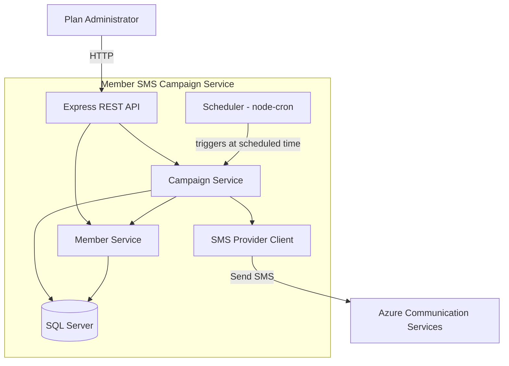
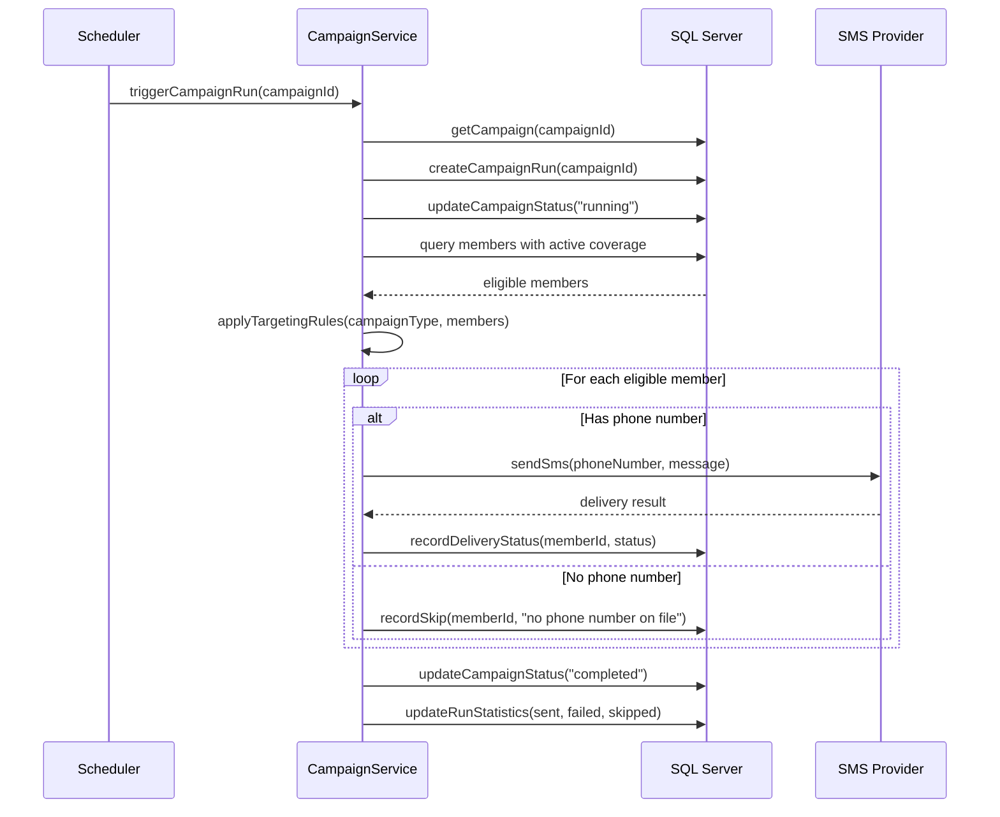
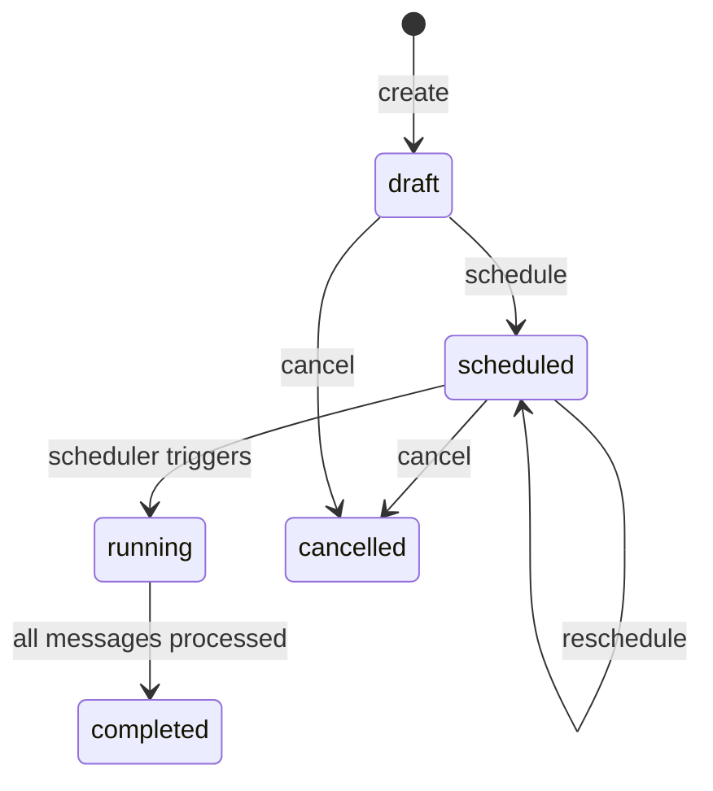

# Design Document: Member SMS Campaign

## Overview

The Member SMS Campaign application is a standalone TypeScript/Node.js service that enables healthcare plan administrators to create, schedule, and execute targeted SMS campaigns to members with active coverage. It is a completely self-contained project with its own member and coverage data managed via REST APIs and stored in SQL Server.

The system supports four campaign types (Welcome, Referral, Utilization, Holiday), each with distinct targeting rules based on coverage period dates. Holiday campaigns are restricted to November and December scheduling. Beyond automated campaigns, it provides manual single and bulk SMS capabilities for ad-hoc member communication. All SMS delivery is handled through an external SMS provider (Azure Communication Services), with comprehensive delivery tracking and reporting.

### Key Design Decisions

1. **Fully standalone project**: The SMS campaign service is completely self-contained with its own member/coverage data, REST APIs, and database. No external FHIR or healthcare API dependencies.
2. **Azure Communication Services over Twilio**: Chosen for consistency with Azure-hosted infrastructure.
3. **SQL Server for all data**: Uses SQL Server for campaigns, members, coverages, runs, and delivery records. Connects via `mssql` (tedious) driver for Node.js.
4. **node-cron for scheduling**: Simple in-process scheduler sufficient for the campaign execution cadence. Avoids the complexity of a separate job queue for the initial implementation.
5. **Express.js REST API**: Provides the admin-facing HTTP endpoints for member/coverage CRUD, campaign management, manual SMS, and reporting.

## Architecture



### Request Flow: Campaign Execution



## Components and Interfaces

### 1. Express REST API Layer

Handles HTTP routing, request validation, and response formatting.

**Endpoints:**

| Method | Path | Description |
|--------|------|-------------|
| POST | /members | Create a new member |
| GET | /members | List all members (paginated) |
| GET | /members/:id | Get member details with coverages |
| PUT | /members/:id | Update member record |
| GET | /members/search | Search members by name or phone |
| POST | /members/import | Bulk import members via CSV |
| POST | /coverages | Create a coverage record |
| GET | /coverages?memberId=:id | Get coverages for a member |
| PUT | /coverages/:id | Update a coverage record |
| GET | /coverages?status=active | List active coverages (paginated) |
| POST | /campaigns | Create a new campaign |
| GET | /campaigns | List all campaigns |
| GET | /campaigns/:id | Get campaign details with run history |
| PUT | /campaigns/:id/schedule | Schedule or reschedule a campaign |
| POST | /campaigns/:id/cancel | Cancel a scheduled campaign |
| GET | /campaigns/:id/runs/:runId/report | Get campaign run report |
| POST | /sms/send | Send manual single SMS |
| POST | /sms/bulk | Send manual bulk SMS |

### 2. Campaign Service

Core business logic orchestrating campaign lifecycle, eligibility checks, targeting, and SMS delivery.

```typescript
interface ICampaignService {
  createCampaign(input: CreateCampaignInput): Promise<Campaign>;
  scheduleCampaign(campaignId: string, scheduledAt: Date): Promise<Campaign>;
  cancelCampaign(campaignId: string): Promise<Campaign>;
  executeCampaignRun(campaignId: string): Promise<CampaignRun>;
  getCampaign(campaignId: string): Promise<Campaign>;
  listCampaigns(): Promise<Campaign[]>;
  getRunReport(campaignId: string, runId: string): Promise<CampaignRunReport>;
}
```

### 3. Member & Coverage Service

Manages member and coverage data stored in the application's own SQL Server database.

```typescript
interface IMemberService {
  createMember(input: CreateMemberInput): Promise<Member>;
  updateMember(memberId: string, input: UpdateMemberInput): Promise<Member>;
  getMember(memberId: string): Promise<Member>;
  listMembers(page: number, pageSize: number): Promise<PaginatedResult<Member>>;
  searchMembers(query: string): Promise<Member[]>;
  importMembers(csvData: Buffer): Promise<ImportResult>;
}

interface ICoverageService {
  createCoverage(input: CreateCoverageInput): Promise<Coverage>;
  updateCoverage(coverageId: string, input: UpdateCoverageInput): Promise<Coverage>;
  getCoveragesByMember(memberId: string): Promise<Coverage[]>;
  listActiveCoverages(page: number, pageSize: number): Promise<PaginatedResult<Coverage>>;
}
```

Data is queried directly from SQL Server — no external API calls needed for eligibility checks.

### 4. SMS Provider Client

Wraps Azure Communication Services SDK for sending SMS messages.

```typescript
interface ISmsProviderClient {
  sendSms(to: string, message: string): Promise<SmsDeliveryResult>;
}

interface SmsDeliveryResult {
  success: boolean;
  messageId?: string;
  failureReason?: string;
}
```

Retry logic: up to 3 retries with exponential backoff on provider unreachable errors.

### 5. Scheduler

Uses `node-cron` to poll for campaigns whose `scheduledAt` time has arrived. Runs a check every minute.

```typescript
interface IScheduler {
  start(): void;
  stop(): void;
}
```

On each tick, the scheduler queries the database for campaigns with status "scheduled" and `scheduledAt <= now`, then triggers `CampaignService.executeCampaignRun()` for each.

### 6. Manual SMS Service

Handles single and bulk SMS sends outside the campaign lifecycle.

```typescript
interface IManualSmsService {
  sendSingle(input: ManualSingleSmsInput): Promise<ManualSmsResult>;
  sendBulk(input: ManualBulkSmsInput): Promise<BulkSmsReport>;
}
```

### 7. Eligibility Service

Encapsulates the eligibility verification logic by querying the local coverages table. Reused by both campaign execution and manual SMS flows.

```typescript
interface IEligibilityService {
  checkEligibility(memberId: string): Promise<EligibilityResult>;
  filterEligibleMembers(memberIds: string[]): Promise<EligibilityFilterResult>;
}

interface EligibilityResult {
  eligible: boolean;
  reason?: string; // "no active coverage" | "eligibility check failed"
}

interface EligibilityFilterResult {
  eligible: string[];
  excluded: Array<{ memberId: string; reason: string }>;
}
```

### 8. Targeting Service

Applies campaign-type-specific member filtering rules before eligibility checks.

```typescript
interface ITargetingService {
  resolveTargetMembers(campaignType: CampaignType): Promise<string[]>;
}
```

Targeting rules:
- **Welcome**: Coverage `period.start` within last 30 days
- **Referral**: Coverage `period.start` older than 30 days AND active coverage
- **Utilization**: All members with active coverage
- **Holiday**: All members with active coverage (same as Utilization)

## Data Models

### Member

```typescript
interface Member {
  id: string;                    // UUID
  firstName: string;
  lastName: string;
  dateOfBirth: string | null;    // ISO date
  phoneNumber: string | null;
  createdAt: Date;
  updatedAt: Date;
}
```

### Coverage

```typescript
interface Coverage {
  id: string;                    // UUID
  memberId: string;              // FK to Member
  planName: string;
  status: "active" | "inactive" | "cancelled";
  periodStart: string;           // ISO date
  periodEnd: string | null;      // ISO date, null = ongoing
  createdAt: Date;
  updatedAt: Date;
}
```

### Campaign

```typescript
interface Campaign {
  id: string;                    // UUID
  name: string;                  // Campaign name
  type: CampaignType;           // "welcome" | "referral" | "utilization"
  messageTemplate: string;       // Max 160 characters
  status: CampaignStatus;       // "draft" | "scheduled" | "running" | "completed" | "cancelled"
  scheduledAt: Date | null;      // Null when draft
  createdAt: Date;
  updatedAt: Date;
}

type CampaignType = "welcome" | "referral" | "utilization" | "holiday";
type CampaignStatus = "draft" | "scheduled" | "running" | "completed" | "cancelled";
```

### Campaign Run

```typescript
interface CampaignRun {
  id: string;                    // UUID
  campaignId: string;            // FK to Campaign
  status: "running" | "completed" | "failed";
  totalEligible: number;
  totalSent: number;
  totalFailed: number;
  totalSkipped: number;
  startedAt: Date;
  completedAt: Date | null;
}
```

### Delivery Record

```typescript
interface DeliveryRecord {
  id: string;                    // UUID
  campaignRunId: string | null;  // FK to CampaignRun (null for manual SMS)
  manualSmsId: string | null;    // FK to ManualSmsLog (null for campaign SMS)
  memberId: string;              // FHIR Patient ID
  phoneNumber: string | null;
  status: DeliveryStatus;        // "sent" | "failed" | "skipped" | "excluded"
  reason: string | null;         // Failure/skip/exclusion reason
  sentAt: Date | null;
  createdAt: Date;
}

type DeliveryStatus = "sent" | "failed" | "skipped" | "excluded";
```

### Manual SMS Log

```typescript
interface ManualSmsLog {
  id: string;                    // UUID
  type: "single" | "bulk";
  message: string;               // Max 160 characters
  totalSent: number;
  totalFailed: number;
  totalSkipped: number;
  createdAt: Date;
  completedAt: Date | null;
}
```

### Campaign State Machine



### Database Schema (SQL Server)

```sql
CREATE TABLE members (
  id UNIQUEIDENTIFIER PRIMARY KEY DEFAULT NEWID(),
  first_name NVARCHAR(100) NOT NULL,
  last_name NVARCHAR(100) NOT NULL,
  date_of_birth DATE,
  phone_number NVARCHAR(20),
  created_at DATETIMEOFFSET NOT NULL DEFAULT SYSDATETIMEOFFSET(),
  updated_at DATETIMEOFFSET NOT NULL DEFAULT SYSDATETIMEOFFSET()
);

CREATE TABLE coverages (
  id UNIQUEIDENTIFIER PRIMARY KEY DEFAULT NEWID(),
  member_id UNIQUEIDENTIFIER NOT NULL REFERENCES members(id),
  plan_name NVARCHAR(255) NOT NULL,
  status NVARCHAR(20) NOT NULL DEFAULT 'active' CHECK (status IN ('active', 'inactive', 'cancelled')),
  period_start DATE NOT NULL,
  period_end DATE,
  created_at DATETIMEOFFSET NOT NULL DEFAULT SYSDATETIMEOFFSET(),
  updated_at DATETIMEOFFSET NOT NULL DEFAULT SYSDATETIMEOFFSET()
);

CREATE TABLE campaigns (
  id UNIQUEIDENTIFIER PRIMARY KEY DEFAULT NEWID(),
  name NVARCHAR(255) NOT NULL,
  type NVARCHAR(20) NOT NULL CHECK (type IN ('welcome', 'referral', 'utilization', 'holiday')),
  message_template NVARCHAR(160) NOT NULL,
  status NVARCHAR(20) NOT NULL DEFAULT 'draft' CHECK (status IN ('draft', 'scheduled', 'running', 'completed', 'cancelled')),
  scheduled_at DATETIMEOFFSET,
  created_at DATETIMEOFFSET NOT NULL DEFAULT SYSDATETIMEOFFSET(),
  updated_at DATETIMEOFFSET NOT NULL DEFAULT SYSDATETIMEOFFSET()
);

CREATE TABLE campaign_runs (
  id UNIQUEIDENTIFIER PRIMARY KEY DEFAULT NEWID(),
  campaign_id UNIQUEIDENTIFIER NOT NULL REFERENCES campaigns(id),
  status NVARCHAR(20) NOT NULL DEFAULT 'running',
  total_eligible INT NOT NULL DEFAULT 0,
  total_sent INT NOT NULL DEFAULT 0,
  total_failed INT NOT NULL DEFAULT 0,
  total_skipped INT NOT NULL DEFAULT 0,
  started_at DATETIMEOFFSET NOT NULL DEFAULT SYSDATETIMEOFFSET(),
  completed_at DATETIMEOFFSET
);

CREATE TABLE manual_sms_logs (
  id UNIQUEIDENTIFIER PRIMARY KEY DEFAULT NEWID(),
  type NVARCHAR(10) NOT NULL CHECK (type IN ('single', 'bulk')),
  message NVARCHAR(160) NOT NULL,
  total_sent INT NOT NULL DEFAULT 0,
  total_failed INT NOT NULL DEFAULT 0,
  total_skipped INT NOT NULL DEFAULT 0,
  created_at DATETIMEOFFSET NOT NULL DEFAULT SYSDATETIMEOFFSET(),
  completed_at DATETIMEOFFSET
);

CREATE TABLE delivery_records (
  id UNIQUEIDENTIFIER PRIMARY KEY DEFAULT NEWID(),
  campaign_run_id UNIQUEIDENTIFIER REFERENCES campaign_runs(id),
  manual_sms_id UNIQUEIDENTIFIER REFERENCES manual_sms_logs(id),
  member_id NVARCHAR(255) NOT NULL,
  phone_number NVARCHAR(20),
  status NVARCHAR(20) NOT NULL CHECK (status IN ('sent', 'failed', 'skipped', 'excluded')),
  reason NVARCHAR(MAX),
  sent_at DATETIMEOFFSET,
  created_at DATETIMEOFFSET NOT NULL DEFAULT SYSDATETIMEOFFSET()
);

CREATE INDEX idx_members_name ON members(last_name, first_name);
CREATE INDEX idx_members_phone ON members(phone_number);
CREATE INDEX idx_coverages_member ON coverages(member_id);
CREATE INDEX idx_coverages_status ON coverages(status, period_start, period_end);
CREATE INDEX idx_campaigns_status_scheduled ON campaigns(status, scheduled_at);
CREATE INDEX idx_campaign_runs_campaign ON campaign_runs(campaign_id);
CREATE INDEX idx_delivery_records_run ON delivery_records(campaign_run_id);
CREATE INDEX idx_delivery_records_manual ON delivery_records(manual_sms_id);
```


## Correctness Properties

*A property is a characteristic or behavior that should hold true across all valid executions of a system — essentially, a formal statement about what the system should do. Properties serve as the bridge between human-readable specifications and machine-verifiable correctness guarantees.*

### Property 1: Campaign creation produces draft status

*For any* valid campaign creation input (valid name, valid campaign type, message template of 1–160 characters), the resulting campaign record SHALL have status "draft".

**Validates: Requirements 1.1**

### Property 2: Campaign type validation

*For any* string value provided as a campaign type, campaign creation SHALL succeed if and only if the value is one of "welcome", "referral", "utilization", or "holiday". Any other value SHALL result in a validation error listing the allowed types.

**Validates: Requirements 1.2, 1.5**

### Property 3: Required field validation rejects incomplete input

*For any* campaign creation input where one or more required fields (name, campaign type, message template) are missing or empty, the Campaign_Service SHALL return a validation error that specifies which fields are missing.

**Validates: Requirements 1.3**

### Property 4: Message length validation

*For any* message string, the system SHALL accept it if and only if its length is between 1 and 160 characters (inclusive). This applies uniformly to campaign message templates, manual single SMS messages, and manual bulk SMS messages.

**Validates: Requirements 1.4, 9.2, 10.3**

### Property 5: Scheduling transitions to scheduled status

*For any* campaign in "draft" or "scheduled" status and any future date, calling schedule SHALL result in the campaign having status "scheduled" with the provided date stored as the schedule. Any previously stored schedule date SHALL be replaced.

**Validates: Requirements 2.1, 2.3**

### Property 6: Past date scheduling rejection

*For any* date that is in the past relative to the current time, attempting to schedule a campaign with that date SHALL result in a validation error.

**Validates: Requirements 2.2**

### Property 7: Scheduling status guard

*For any* campaign whose status is not "draft" or "scheduled" (i.e., "running", "completed", or "cancelled"), attempting to schedule it SHALL result in an error.

**Validates: Requirements 2.4**

### Property 8: Eligibility determination correctness

*For any* member and their set of Coverage resources, the eligibility check SHALL return eligible=true if and only if there exists at least one Coverage with status "active" and a period that includes the current date. Otherwise, the member SHALL be marked as excluded with reason "no active coverage".

**Validates: Requirements 3.2, 3.3**

### Property 9: Campaign run status lifecycle

*For any* campaign run execution, the campaign status SHALL transition to "running" when the run begins, and SHALL transition to "completed" with a recorded completion timestamp when all messages have been processed.

**Validates: Requirements 4.2, 4.4**

### Property 10: Members without phone numbers are skipped

*For any* member whose Patient resource does not contain a phone number, the system SHALL skip that member and record the skip reason as "no phone number on file". This applies to campaign runs, manual single SMS (as a rejection), and manual bulk SMS.

**Validates: Requirements 4.5, 9.5, 10.6**

### Property 11: Delivery status matches provider outcome

*For any* SMS send attempt, if the SMS provider returns success then the delivery record SHALL have status "sent"; if the provider returns failure then the delivery record SHALL have status "failed" with the failure reason stored. This applies to campaign sends, manual single SMS, and manual bulk SMS.

**Validates: Requirements 5.1, 5.2, 9.6, 9.7**

### Property 12: Run statistics invariant

*For any* completed campaign run, the sum of totalSent + totalFailed + totalSkipped SHALL equal the total number of members that were targeted (after targeting rules and eligibility filtering).

**Validates: Requirements 5.4**

### Property 13: Welcome campaign targeting

*For any* set of Coverage resources, a Welcome campaign SHALL target only members whose coverage has a period start date within the last 30 days from the current date.

**Validates: Requirements 6.1**

### Property 14: Referral campaign targeting

*For any* set of Coverage resources, a Referral campaign SHALL target only members whose coverage has a period start date older than 30 days and who have active coverage.

**Validates: Requirements 6.2**

### Property 15: Utilization campaign targeting

*For any* set of Coverage resources, a Utilization campaign SHALL target all members who have active coverage.

**Validates: Requirements 6.3**

### Property 16: Campaign list and detail completeness

*For any* set of campaigns stored in the system, the list endpoint SHALL return every campaign with its status, type, and schedule. The detail endpoint SHALL additionally include the message template and campaign run history.

**Validates: Requirements 7.1, 7.2**

### Property 17: Campaign cancellation transitions to cancelled

*For any* campaign in "draft" or "scheduled" status, cancellation SHALL update the status to "cancelled".

**Validates: Requirements 7.3**

### Property 18: Cancellation status guard

*For any* campaign in "running" or "completed" status, attempting to cancel it SHALL result in an error indicating the campaign cannot be cancelled in its current status.

**Validates: Requirements 7.4**

### Property 19: Run report completeness

*For any* campaign run, the report SHALL include the total eligible count, sent count, failed count, skipped count, and a per-member delivery status breakdown with member identifier, status, and reason where applicable.

**Validates: Requirements 8.1, 8.2**

### Property 20: Campaign runs listed in reverse chronological order

*For any* campaign with multiple runs, the runs SHALL be listed in descending order of their start timestamp.

**Validates: Requirements 8.3**

### Property 21: Manual single SMS eligibility and phone guard

*For any* manual single SMS request, if the specified member does not have active coverage, the request SHALL be rejected with an error indicating no active coverage. If the member has active coverage but no phone number, the request SHALL be rejected with an error indicating no phone number on file.

**Validates: Requirements 9.3, 9.4, 9.5**

### Property 22: Bulk SMS eligibility filtering

*For any* list of members in a bulk SMS request, only members with active coverage SHALL receive messages. Members without active coverage SHALL be excluded with reason "no active coverage".

**Validates: Requirements 10.4, 10.5**

### Property 23: Bulk SMS report consistency

*For any* completed bulk SMS operation, the returned summary report's sent + failed + skipped counts SHALL equal the total number of targeted members, and each count SHALL match the actual delivery records.

**Validates: Requirements 10.8**

### Property 24: Bulk SMS continues on individual failure

*For any* bulk SMS operation where the SMS provider fails for one or more members, the system SHALL continue sending to the remaining members. The total number of processed members (sent + failed + skipped) SHALL equal the total targeted.

**Validates: Requirements 10.9**

### Property 25: Segment resolution correctness

*For any* member segment filter (e.g., all members with active coverage), the resolved member list SHALL contain exactly the members matching the filter criteria.

**Validates: Requirements 10.2**

### Property 26: Holiday campaign scheduling date restriction

*For any* Holiday campaign and any schedule date, scheduling SHALL succeed if and only if the date falls in November (month 11) or December (month 12). Any date in months 1–10 SHALL result in a validation error.

**Validates: Requirements 11.1, 11.2, 11.3**

### Property 27: Holiday campaign targeting

*For any* set of Coverage resources, a Holiday campaign SHALL target all members who have active coverage. The set of targeted members SHALL be identical to the set targeted by a Utilization campaign on the same Coverage data.

**Validates: Requirements 6.5**

## Error Handling

### Database Errors

| Scenario | Behavior |
|----------|----------|
| Database unreachable | Retry up to 3 times with exponential backoff (1s, 2s, 4s). After 3 failures, mark member as "eligibility check failed". |
| Member not found | Return 404 with error message. |
| Coverage not found for member | Mark member as excluded with reason "no active coverage". |

### SMS Provider Errors

| Scenario | Behavior |
|----------|----------|
| Provider unreachable | Retry up to 3 times with exponential backoff (1s, 2s, 4s). After 3 failures, record delivery status "failed" with reason "provider unreachable". |
| Provider returns failure | Record delivery status "failed" with the provider's failure reason. No retry. |
| Invalid phone number format | Record delivery status "failed" with reason "invalid phone number". |

### Validation Errors

All validation errors return HTTP 400 with a JSON body:

```json
{
  "error": "VALIDATION_ERROR",
  "message": "Human-readable description",
  "details": [
    { "field": "messageTemplate", "issue": "exceeds 160 character limit" }
  ]
}
```

### Campaign State Transition Errors

Invalid state transitions (e.g., cancelling a running campaign) return HTTP 409 Conflict:

```json
{
  "error": "INVALID_STATE_TRANSITION",
  "message": "Cannot cancel a campaign in 'running' status"
}
```

### Partial Failure Handling

During campaign runs and bulk SMS, individual member failures do not halt the overall operation. The system processes all members and reports aggregate results. This ensures maximum delivery even when some members encounter issues.

## Testing Strategy

### Unit Tests

Unit tests cover specific examples, edge cases, and error conditions using Jest:

- Campaign creation with valid/invalid inputs (specific examples)
- Scheduling with exact boundary dates (edge case: exactly now, 1 second in future)
- Message template at exactly 160 characters and 161 characters (boundary)
- Eligibility check with various coverage period combinations (specific examples)
- Campaign state machine transitions (all valid and invalid transitions)
- FHIR API client retry behavior with mocked failures (3 retries, exponential backoff)
- SMS provider client retry behavior with mocked failures
- Targeting rules with specific date scenarios (edge case: exactly 30 days ago)
- Manual SMS rejection for ineligible members
- Bulk SMS partial failure continuation
- Run report aggregation with known data

### Property-Based Tests

Property-based tests use [fast-check](https://github.com/dubzzz/fast-check) to verify universal properties across randomized inputs. Each property test runs a minimum of 100 iterations.

Each test is tagged with a comment referencing the design property:

```typescript
// Feature: member-sms-campaign, Property 4: Message length validation
```

**Property tests to implement:**

1. **Property 1**: Generate random valid inputs → verify draft status
2. **Property 2**: Generate random strings → verify acceptance iff in allowed set
3. **Property 3**: Generate inputs with random field omissions → verify rejection with correct field names
4. **Property 4**: Generate random-length strings → verify acceptance iff 1–160 chars
5. **Property 5**: Generate random future dates for draft/scheduled campaigns → verify scheduled status and date stored
6. **Property 6**: Generate random past dates → verify rejection
7. **Property 7**: Generate campaigns in non-schedulable statuses → verify rejection
8. **Property 8**: Generate random coverage sets → verify eligibility iff active + current period
9. **Property 9**: Execute runs on random campaigns → verify status transitions
10. **Property 10**: Generate members with/without phone numbers → verify skip behavior
11. **Property 11**: Generate random provider outcomes → verify delivery record matches
12. **Property 12**: Execute runs with random member sets → verify sent + failed + skipped = total
13. **Property 13**: Generate coverage sets with random period.start dates → verify Welcome targets only ≤30 days
14. **Property 14**: Generate coverage sets with random period.start dates → verify Referral targets only >30 days + active
15. **Property 15**: Generate coverage sets → verify Utilization targets all active
16. **Property 16**: Store random campaigns → verify list/detail returns all required fields
17. **Property 17**: Generate draft/scheduled campaigns → verify cancellation sets "cancelled"
18. **Property 18**: Generate running/completed campaigns → verify cancellation rejected
19. **Property 19**: Generate runs with random delivery records → verify report contains all fields
20. **Property 20**: Generate campaigns with multiple runs at random times → verify reverse chronological order
21. **Property 21**: Generate members with random eligibility/phone states → verify manual SMS guard
22. **Property 22**: Generate member lists with mixed eligibility → verify only eligible receive messages
23. **Property 23**: Execute bulk SMS with random members → verify report counts match records
24. **Property 24**: Execute bulk SMS with random provider failures → verify all members processed
25. **Property 25**: Generate member data with random coverage → verify segment resolution matches filter
26. **Property 26**: Generate random dates across all 12 months for Holiday campaigns → verify acceptance iff month is 11 or 12
27. **Property 27**: Generate coverage sets → verify Holiday targets identical to Utilization targets (all active coverage)

### Test Infrastructure

- **Framework**: Jest with `ts-jest`
- **Property testing**: `fast-check`
- **Mocking**: Jest mocks for SMS provider client; SQL Server queries use in-memory test database
- **Database**: In-memory SQLite or test SQL Server container for integration tests
- **Minimum iterations**: 100 per property test
- **CI**: All tests run on every PR via GitHub Actions / Azure Pipelines
